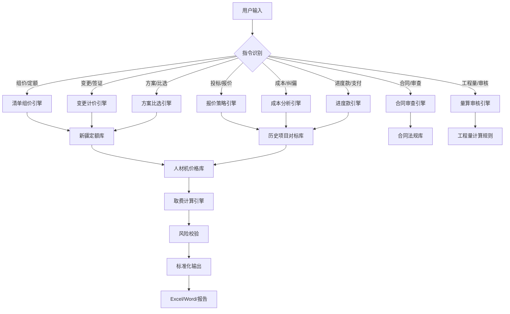

# 新疆工程造价智能工作台 V2.0 工作说明书

## 一、工作台整体运作逻辑

### 1.1 核心理念
```
用户输入指令 → Agent路由分发 → 知识库检索匹配 → 专业计算引擎 → 标准化输出
     ↓              ↓                 ↓                 ↓              ↓
  造价需求      8大专业场景      定额/价格/项目库    人材机取费计算   Excel/Word输出
```

### 1.2 工作流程总览



---

## 二、各功能模块工作原理

### 2.1 清单组价引擎

#### 工作流程
```
1. 用户输入：清单编码 + 项目特征 + 工程量 + 工程地点 + 工期
2. 定额匹配：
   ├─ 根据清单编码匹配新疆2024版定额子目
   ├─ 按项目特征调整定额含量
   └─ 多定额组合时自动加权计算
3. 人材机取价：
   ├─ 人工费：按工程地点信息价
   ├─ 材料费：按当地信息价 + 运杂费
   └─ 机械费：按新疆定额台班单价
4. 取费计算：
   ├─ 计费基数 = 人工费 + 机械费
   ├─ 管理费 = 计费基数 × 对应专业费率
   ├─ 利润 = 计费基数 × 对应专业利润率
   ├─ 规费 = 计费基数 × 对应专业规费费率
   └─ 人工调增值只计税金
5. 风险校验：
   ├─ 与历史项目综合单价对比
   ├─ ±5%偏差红线预警
   └─ 待核实项标注
6. 输出：综合单价分析表
```

#### 输入输出示例
```
【输入】
/组价 010502001 矩形柱 C30混凝土 柱高4.5m 100m³ 乌鲁木齐 工期6个月

【输出】
┌─────────────────────────────────────────────────────┐
│ 综合单价分析表                                      │
├──────────┬──────────┬──────────┬──────────┬──────────┤
│ 项目编码 │ 010502001 │ 项目名称 │ 矩形柱   │ 单位  │ m³ │
├──────────┼──────────┴──────────┴──────────┴──────────┤
│ 定额子目 │ 新疆2024建筑定额 5-xxx 矩形柱 C30        │
├──────────┼──────────┬──────────┬──────────┬──────────┤
│ 人工费   │  xxx元  │ 材料费   │  xxx元  │ 机械费 │ xxx元 │
├──────────┼──────────┼──────────┼──────────┼──────────┤
│ 管理费   │  xxx元  │ 利润     │  xxx元  │ 规费  │ xxx元 │
├──────────┼──────────┴──────────┴──────────┴──────────┤
│ 税金     │  xxx元  │ 综合单价 │  xxx元/m³          │
├──────────┼──────────┬──────────┬──────────┬──────────┤
│ 风险提示 │ ⚠C30混凝土价格待询价确认                  │
└──────────┴──────────┴──────────┴──────────┴──────────┘
```

---

### 2.2 变更签证计价引擎

#### 工作流程
```
1. 用户输入：签证内容 + 现场情况 + 合同约定 + 原清单单价
2. 合同符合性审查：
   ├─ 检查变更是否在合同范围内
   ├─ 确认变更计价原则
   └─ 识别签证时效要求
3. 工程量核算：
   ├─ 按图纸/现场测量计算
   ├─ 与原清单量差对比
   └─ 核增核减确认
4. 单价确定：
   ├─ 已有适用单价 → 直接套用
   ├─ 已有类似单价 → 参照调整
   └─ 无适用单价 → 重新组价
5. 索赔计算：
   ├─ 工期索赔计算
   ├─ 费用索赔（人工窝工、机械停滞、管理费）
   └─ 资金成本计算
6. 风险评级：
   ├─ 🔴高风险：证据不足、合同不利、金额大
   ├─ 🟡中风险：部分证据、条款有争议
   └─ 🔵低风险：证据充分、合同明确
7. 输出：签证计价单 + 风险提示
```

#### 关键判断逻辑
- **签证四要素**：书面确认、时效内、原因清晰、量化准确
- **量差处理**：±15%以内按原单价，超出部分可协商调整
- **价差处理**：合同约定风险范围以内不调整，以外按实调整
- **措施费调整**：工程量变更超过10%时措施费相应调整

---

### 2.3 投标报价策略引擎

#### 工作流程
```
1. 用户输入：最高限价 + 评标办法 + 项目特征 + 竞争对手分析
2. 成本底线测算：
   ├─ 直接费成本测算（人材机市场价格）
   ├─ 管理费、规费计算
   ├─ 预期利润设定
   └─ 税金计算
3. 历史对标分析：
   ├─ 同地区同类型项目中标下浮率
   ├─ 竞争对手历史报价习惯
   └─ 评标基准价预测
4. 最优报价区间计算：
   ├─ 按评标办法计算价格得分曲线
   ├─ 确定满分报价区间（通常基准价下浮3%~7%）
   └─ 考虑不平衡报价空间
5. 不平衡报价建议：
   ├─ 前期工程单价适当提高
   ├─ 工程量可能增加的项目提高单价
   ├─ 图纸不明确或有误的项目提高单价
   └─ 暂定项目报价策略
6. 风险清单项识别：
   ├─ 暂估价项目风险
   ├─ 材料价格波动风险
   └─ 地质条件变化风险
7. 输出：报价方案 + 策略说明 + 风险清单
```

#### 新疆地区报价数据基准
```
┌──────────────────┬──────────┬──────────┬──────────┐
│ 项目类型         │ 下浮率区间│ 单方造价 │ 措施费占比│
├──────────────────┼──────────┼──────────┼──────────┤
│ 住宅建筑         │ 8%~15%   │ 1800~2800│ 10%~15%  │
│ 公共建筑         │ 10%~18%  │ 2800~4500│ 12%~18%  │
│ 市政道路         │ 12%~20%  │ 600~1200万/km│ 8%~12%│
│ 工业厂房         │ 6%~12%   │ 1500~2500│ 8%~12%  │
└──────────────────┴──────────┴──────────┴──────────┘
```

---

### 2.4 成本纠偏引擎

#### 工作流程
```
1. 用户输入：目标成本 + 实际发生成本 + 偏差项明细
2. 偏差计算：
   ├─ 绝对偏差 = 实际成本 - 目标成本
   ├─ 相对偏差率 = 绝对偏差 / 目标成本 × 100%
   └─ 按专业分部拆分偏差
3. 原因分析：
   ├─ 量差原因：工程量计算错误、设计变更、施工浪费
   ├─ 价差原因：材料涨价、人工涨价、机械租赁涨价
   └─ 效率原因：人工效率低、机械效率低、管理不善
4. 偏差分级：
   ├─ 严重偏差：±10%以上 → 立即叫停，全面审查
   ├─ 较大偏差：±5%~10% → 重点关注，制定纠偏措施
   └─ 正常偏差：±5%以内 → 持续监控
5. 纠偏措施制定：
   ├─ 技术措施：优化施工方案、采用新工艺
   ├─ 经济措施：限额领料、节约奖励
   ├─ 组织措施：调整人员配置、加强管理
   └─ 合同措施：索赔、变更、分包调整
6. 预计最终成本预测：
   ├─ 按当前进度趋势预测
   ├─ 按纠偏措施实施后预测
   └─ 最坏情况预测
7. 输出：成本偏差分析报告 + 纠偏措施清单
```

#### 纠偏矩阵
```
┌────────────┬─────────────────────────────────────────┐
│ 偏差类型   │ 纠偏措施优先级                           │
├────────────┼─────────────────────────────────────────┤
│ 量差 > 价差│ 1. 工程量复核  2. 施工优化  3. 变更签证  │
│ 价差 > 量差│ 1. 重新询价    2. 材料替换  3. 索赔      │
│ 人工偏差大 │ 1. 班组调整    2. 计件工资  3. 技术培训  │
│ 机械偏差大 │ 1. 优化配置    2. 提高利用率 3. 租赁调整  │
└────────────┴─────────────────────────────────────────┘
```

---

### 2.5 合同审查引擎

#### 工作流程
```
1. 用户输入：合同文本或关键条款
2. 条款拆解：
   ├─ 价款条款：合同价形式、调整方式、风险范围
   ├─ 工期条款：工期天数、节点、延误处罚、提前奖励
   ├─ 变更条款：变更程序、计价原则、时效要求
   ├─ 索赔条款：索赔事项、程序、时限、计算方法
   ├─ 付款条款：预付款、进度款、结算款、质保金比例
   ├─ 质保条款：质保期、质保范围、质保金返还
   └─ 违约条款：发包方违约、承包方违约、违约金上限
3. 风险评级：
   ├─ 🔴高风险：显失公平、违约金过高、风险全包、付款条件苛刻
   ├─ 🟡中风险：部分条款不利、有争议空间、举证要求高
   └─ 🔵低风险：条款公平、权责对等、符合示范文本
4. 法条绑定：
   ├─ 《民法典》合同编
   ├─ 《建设工程价款结算暂行办法》
   ├─ 《建设工程工程量清单计价规范》GB50500-2013
   └─ 新疆地方规定
5. 修改建议：
   ├─ 高风险条款必须修改
   ├─ 中风险条款建议修改
   └─ 低风险条款可接受
6. 输出：合同审查意见书（风险分级 + 法条依据 + 修改建议）
```

#### 高风险条款识别清单
```
🔴 必须警惕的合同条款：
1. "除设计变更外，合同价一律不作调整" → 材料涨价风险全包
2. "承包人已充分了解现场条件，地质变化风险自行承担" → 地质风险转移
3. "工程变更需发包人书面确认，否则不予计量" → 变更确认门槛高
4. "逾期索赔视为放弃权利" → 索赔时效短，举证要求高
5. "发包人有权对工程量进行审计，审减超过5%部分审计费由承包人承担" → 审计风险
6. "质保金返还需经发包人最终验收合格后" → 质保金返还条件模糊
7. "违约金上限不设限" → 违约风险敞口过大
```

---

### 2.6 方案比选引擎

#### 工作流程
```
1. 用户输入：两个及以上施工方案描述 + 工程量 + 工期要求
2. 造价测算：
   ├─ 方案1：人材机费用 + 措施费 + 管理费 + 利润 + 税金
   ├─ 方案2：同上
   └─ 方案N：同上
3. 工期对比：
   ├─ 绝对工期对比
   ├─ 关键线路分析
   ├─ 冬施期影响分析
   └─ 工期提前/延误奖惩计算
4. 风险对比：
   ├─ 技术风险：施工难度、质量风险
   ├─ 安全风险：高危作业、安全措施费
   ├─ 市场风险：材料供应、价格波动
   └─ 气候风险：冬施、雨季、风沙影响
5. 综合评分：
   ├─ 造价权重：40%
   ├─ 工期权重：30%
   ├─ 风险权重：20%
   └─ 质量权重：10%
6. 新疆特殊条件校核：
   ├─ 冬季施工可行性
   ├─ 材料运输距离与成本
   ├─ 高原降效影响
   └─ 风沙防护措施
7. 输出：方案比选报告 + 推荐意见
```

#### 比选表示例
```
┌──────────┬──────────┬──────────┬──────────┬──────────┐
│ 对比项   │ 权重     │ 方案A    │ 方案B    │ 优选     │
├──────────┼──────────┼──────────┼──────────┼──────────┤
│ 总造价   │ 40%      │ 1000万   │ 1050万   │ A        │
│ 工期     │ 30%      │ 180天    │ 150天    │ B        │
│ 技术风险 │ 20%      │ 中       │ 高       │ A        │
│ 质量可靠 │ 10%      │ 高       │ 中       │ A        │
├──────────┼──────────┼──────────┼──────────┼──────────┤
│ 综合得分 │ 100%     │ 85分     │ 78分     │ A        │
└──────────┴──────────┴──────────┴──────────┴──────────┘
```

---

### 2.7 工程量审核引擎

#### 工作流程
```
1. 用户输入：图纸尺寸描述 + 清单工程量 + 计算规则
2. 工程量复核计算：
   ├─ 按图纸尺寸重新计算
   ├─ 按计算规则核对
   └─ 与清单工程量对比
3. 差异原因分析：
   ├─ 计算规则理解差异
   ├─ 图纸理解差异
   ├─ 计算错误
   └─ 漏项/多项
4. 核增核减计算：
   ├─ 核增金额 = 核增工程量 × 综合单价
   ├─ 核减金额 = 核减工程量 × 综合单价
   └─ 净增减 = 核增 - 核减
5. 审核意见：
   ├─ 同意：工程量准确
   ├─ 调整：工程量有偏差，建议调整
   └─ 重算：偏差较大，需重新计算
6. 输出：工程量审核表 + 计算过程 + 审核意见
```

#### 常用计算规则速查
```
┌──────────┬─────────────────────────────────┐
│ 项目     │ 计算规则要点                     │
├──────────┼─────────────────────────────────┤
│ 土方     │ 按天然密实体积计算，放坡系数查表 │
│ 混凝土   │ 按图示尺寸体积计算，不扣钢筋体积 │
│ 钢筋     │ 按长度×理论重量计算，含搭接损耗  │
│ 模板     │ 按接触面积计算，含施工损耗        │
│ 脚手架   │ 按建筑面积或垂直投影面积计算     │
│ 防水     │ 按实际铺设面积计算，含搭接宽度    │
└──────────┴─────────────────────────────────┘
```

---

### 2.8 进度款审核引擎

#### 工作流程
```
1. 用户输入：已完工程量 + 合同付款节点 + 累计已付款 + 变更签证金额
2. 已完工程量核对：
   ├─ 按形象进度核实
   ├─ 与合同清单对比
   └─ 确认已完合格工程量
3. 进度款计算：
   ├─ 已完工程价款 = 已完工程量 × 综合单价
   ├─ 变更签证价款 = 已确认变更金额
   ├─ 合计应付 = 已完工程价款 + 变更签证价款
   └─ 本次应付 = 合计应付 × 付款比例 - 累计已付款
4. 扣款事项核对：
   ├─ 预付款抵扣
   ├─ 质保金预留
   ├─ 甲供材扣款
   ├─ 违约金/罚款
   └─ 其他扣款
5. 付款比例核对：
   ├─ 核对合同约定付款比例
   ├─ 检查是否达到付款节点
   └─ 确认累计付款不超过合同约定比例
6. 输出：进度款审核表 + 付款审核意见
```

#### 进度款审核要点
```
✅ 必查事项：
1. 已完工程是否验收合格
2. 工程量是否与现场形象进度一致
3. 变更签证是否有书面确认
4. 付款比例是否符合合同约定
5. 预付款、质保金、甲供材是否按约定扣除
6. 累计付款是否超过合同上限

⚠ 风险提示：
- 形象进度超过实际进度 → 超付风险
- 变更签证未确认即付款 → 结算风险
- 质保金预留不足 → 后期质保风险
```

---

## 三、知识库检索机制

### 3.1 检索优先级
```
1. 当前项目资料 > 同地区项目 > 同类型项目 > 通用定额
2. 新疆2024定额 > 新疆2020定额 > 全国统一定额
3. 合同约定 > 定额规定 > 行业惯例
4. 官方信息价 > 历史成交价 > 市场询价
```

### 3.2 检索路径
```
用户输入关键词
    ↓
项目库检索（按地区、专业、时间匹配）
    ↓
定额库检索（按编码、名称匹配）
    ↓
价格库检索（人材机价格）
    ↓
法规库检索（合同条款、法条）
    ↓
结果加权排序（按相关性、时效性）
    ↓
输出检索结果 + 待核实项标注
```

---

## 四、输出规范与格式

### 4.1 Excel输出规范
```
文件名：[项目名称]_[功能]_[日期].xlsx
Sheet1：汇总表
Sheet2：明细表
Sheet3：计算过程
Sheet4：参考依据

要求：
- 公式完整，可追溯
- 格式统一，字体规范
- 重要数据标色（红色警告、黄色提醒）
- 备注清晰，标注来源
```

### 4.2 Word输出规范
```
文件名：[项目名称]_[功能]_[日期].docx
结构：
1. 结论摘要（一页纸）
2. 详细分析
3. 附件与依据
4. 风险提示

要求：
- 结论先行
- 条理清晰
- 风险分级标注
- 可直接作为正式报告
```

### 4.3 风险标注规范
```
🔴 高风险：必须立即处理，可能造成重大损失
🟡 中风险：需要关注，可能造成一定损失
🔵 低风险：一般风险，持续监控即可
⚠ 待核实：数据不完整，需要进一步确认
✅ 已确认：数据准确，可放心使用
```

---

## 五、Agent协作机制

### 5.1 单Agent独立处理
简单任务（单一清单组价、简单合同条款审查）由对应专业Agent独立完成。

### 5.2 多Agent协同处理
复杂任务（投标报价方案、成本纠偏、重大变更签证）采用多Agent协同：
```
主控Agent（任务分解、结果汇总）
    ├─ 造价Agent（组价计算）
    ├─ 合同Agent（条款审查）
    ├─ 财务Agent（成本分析）
    └─ 风险Agent（风险评估）
```

### 5.3 人工复核机制
- 金额超过100万元的计算结果
- 涉及🔴高风险的结论
- 用户要求复核的任务

以上情况必须标注"建议人工复核"，并提供复核要点。

---

## 六、使用示例

### 示例1：快速组价
```
用户：/组价 010503001 梁 C30 20m³ 哈密
工作台：自动匹配定额 → 取哈密人工价格 → 计算人材机 → 取费 → 输出综合单价分析表
耗时：约15秒
```

### 示例2：合同审查
```
用户：/合同 "合同价款一次性包死，任何情况不作调整"
工作台：识别条款 → 风险评级（🔴高风险）→ 绑定法条 → 给出修改建议
耗时：约10秒
```

### 示例3：成本纠偏
```
用户：/纠偏 目标1000万 实际1080万
工作台：计算偏差率8% → 分析原因 → 给出纠偏措施 → 预测最终成本
耗时：约20秒
```

---

## 七、维护与更新机制

### 7.1 数据更新频率
```
- 人工/材料价格：每月更新（新疆住建厅信息价发布后）
- 定额库：新疆新版定额发布后更新
- 项目库：新项目完成后即时入库
- 法规库：政策变化后即时更新
```

### 7.2 系统优化机制
```
- 用户反馈收集 → 问题分析 → 提示词优化 → 效果验证
- 计算错误 → 规则修正 → 回归测试
- 新需求 → 新提示词开发 → 测试上线
```

---

**文件版本**：V2.0
**生成日期**：2026年6月19日
**适用范围**：新疆工程造价智能工作台
**维护人**：老高 · 新疆工程造价AI助手
