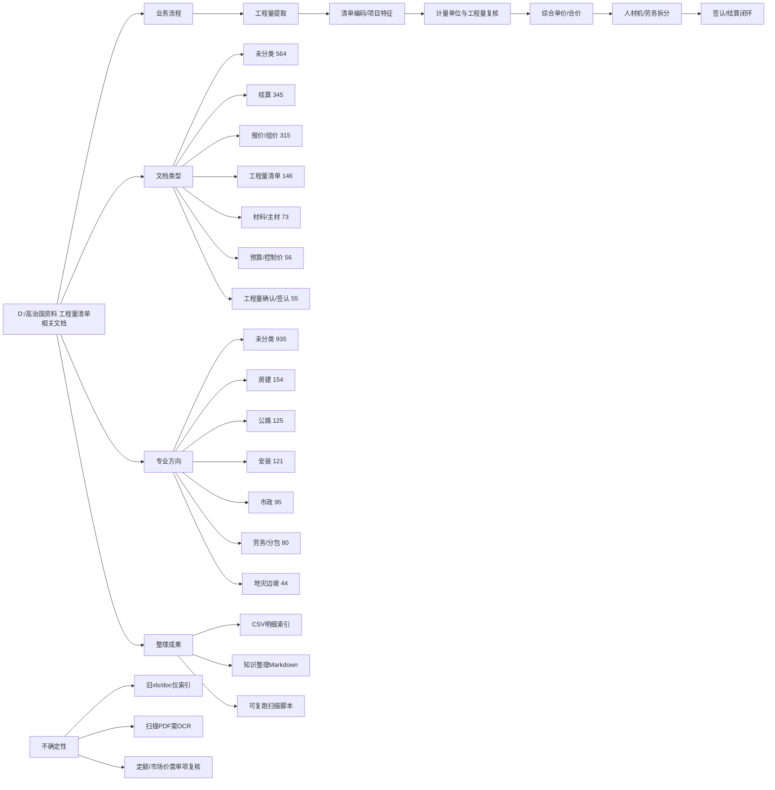

# 工程量清单资料知识框图

```mermaid
flowchart LR
    ROOT["D:/高治国资料 工程量清单相关文档"] --> FLOW["业务流程"]
    ROOT --> TYPE["文档类型"]
    ROOT --> DISC["专业方向"]
    ROOT --> OUT["整理成果"]
    FLOW --> F1["工程量提取"]
    F1 --> F2["清单编码/项目特征"]
    F2 --> F3["计量单位与工程量复核"]
    F3 --> F4["综合单价/合价"]
    F4 --> F5["人材机/劳务拆分"]
    F5 --> F6["签认/结算闭环"]
    TYPE --> T1["未分类 564"]
    TYPE --> T2["结算 345"]
    TYPE --> T3["报价/组价 315"]
    TYPE --> T4["工程量清单 146"]
    TYPE --> T5["材料/主材 73"]
    TYPE --> T6["预算/控制价 56"]
    TYPE --> T7["工程量确认/签认 55"]
    DISC --> D1["未分类 935"]
    DISC --> D2["房建 154"]
    DISC --> D3["公路 125"]
    DISC --> D4["安装 121"]
    DISC --> D5["市政 95"]
    DISC --> D6["劳务/分包 80"]
    DISC --> D7["地灾边坡 44"]
    OUT --> O1["CSV明细索引"]
    OUT --> O2["知识整理Markdown"]
    OUT --> O3["可复跑扫描脚本"]
    RISK["不确定性"] --> R1["旧xls/doc仅索引"]
    RISK --> R2["扫描PDF需OCR"]
    RISK --> R3["定额/市场价需单项复核"]
```

## 使用说明

- 这张框图表达资料库的知识结构，不替代单个项目的清单审核。
- 明细请看 `output/工程量清单资料索引_*.csv`。
- 对旧格式或扫描件，建议转换/OCR 后复跑 `gen_knowledge.py`。
