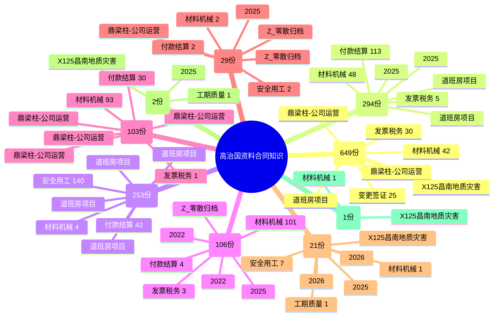

# 高治国资料合同文本知识整理

扫描时间：2026-06-16 19:46:00
源文件处理：只读扫描，未移动、未重命名、未删除源文件。
扫描文件总数：12026
合同相关候选：1458

## 一、合同资料分类
- 其他合同相关资料：649 份
- 结算/对账/付款资料：294 份
- 劳务/派遣/用工协议：253 份
- 机械/设备租赁合同：106 份
- 材料/物资采购租赁：103 份
- 施工承包/分包协议：29 份
- 安全/承诺/函件：21 份
- 合伙/内部管理协议：2 份
- 房屋/场地租赁协议：1 份

## 二、项目分布
- 道班房项目：904 份
- 2025：120 份
- Z_零散归档：116 份
- 2026：73 份
- 特克斯阳光谷：68 份
- 2022：52 份
- X125昌南地质灾害：51 份
- 鼎梁柱-公司运营：44 份
- 海岸广场项目：30 份

## 三、常见风险主题
- 🟡 材料机械：292 次命中
- 🔴 付款结算：191 次命中
- 🔴 安全用工：149 次命中
- 🟡 发票税务：43 次命中
- 🟡 变更签证：29 次命中
- 🟡 工期质量：4 次命中
- 🔴 违约争议：1 次命中

## 四、可复用审查要点
- 🔴 付款结算：重点核查付款节点、计量依据、结算确认、逾期责任、背靠背付款条件。依据：《民法典》第509条、第577条、第579条；建工司法解释相关价款结算条款需结合具体文本复核。
- 🔴 安全用工：劳务、派遣、农民工工资资料需核查实名制、工资代发、工伤责任、安全教育和保险边界。依据：《民法典》第509条；《保障农民工工资支付条例》第24条、第29条。
- 🟡 机械/材料租赁采购：重点核查设备进退场、台班确认、维修停工、材料验收、发票税率、损耗赔偿。依据：《民法典》第703条、第704条、第712条、第770条。
- 🟡 变更签证：现场确认单、工程量签认、签字权限和时限应与合同价款调整条款闭合。依据：《民法典》第543条、第544条、第793条。
- 🔵 发票税务：开票信息、税率、备注栏、付款条件应与合同主体、项目名称、工程地点一致。依据：《民法典》第509条；税务依据需按当期政策复核。

## 五、知识框图

## 六、合同候选清单 Top 80
| 序号 | 类型 | 项目 | 文件名 | 风险主题 | 源路径 |
|---:|---|---|---|---|---|
| 1 | 劳务/派遣/用工协议 | 道班房项目 | JTJJQFA2024-1004-B01  K248+500、K284+800道班房工程施工劳务分包合同补充协议-双面打印四份，签字盖章.pdf | ⚠ 未提取 | `D:\高治国资料\01_进行中项目\道班房项目\01-合同招投标\JTJJQFA2024-1004-B01  K248+500、K284+800道班房工程施工劳务分包合同补充协议-双面打印四份，签字盖章.pdf` |
| 2 | 劳务/派遣/用工协议 | 道班房项目 | JTJJQFA2024-1004-B01  K248+500、K284+800道班房工程施工劳务分包合同补充协议-双面打印四份，签字盖章_1.pdf | ⚠ 未提取 | `D:\高治国资料\01_进行中项目\道班房项目\01-合同招投标\JTJJQFA2024-1004-B01  K248+500、K284+800道班房工程施工劳务分包合同补充协议-双面打印四份，签字盖章_1.pdf` |
| 3 | 劳务/派遣/用工协议 | 道班房项目 | K248+500、K284+800道班房工程施工劳务分包合同 补充协议谈判纪要(1)-双面打印两份签字盖章.pdf | ⚠ 未提取 | `D:\高治国资料\01_进行中项目\道班房项目\01-合同招投标\K248+500、K284+800道班房工程施工劳务分包合同 补充协议谈判纪要(1)-双面打印两份签字盖章.pdf` |
| 4 | 劳务/派遣/用工协议 | 道班房项目 | K248+500、K284+800道班房工程施工劳务分包合同 补充协议谈判纪要(1)-双面打印两份签字盖章_1.pdf | ⚠ 未提取 | `D:\高治国资料\01_进行中项目\道班房项目\01-合同招投标\K248+500、K284+800道班房工程施工劳务分包合同 补充协议谈判纪要(1)-双面打印两份签字盖章_1.pdf` |
| 5 | 其他合同相关资料 | 鼎梁柱-公司运营 | 嘉诚建材标箱租赁合同（不开票）空白(1)23.docx | 发票税务；材料机械 | `D:\高治国资料\鼎梁柱-公司运营\合同协议\2025_\嘉诚建材标箱租赁合同（不开票）空白(1)23.docx` |
| 6 | 劳务/派遣/用工协议 | Z_零散归档 | 吐哈油田吐鲁番鄯善东100万千瓦光伏发电项目二标段35kV集电线路施工劳务及部分材料采购合同 审查意见（乙方视角）.docx | 材料机械 | `D:\高治国资料\Z_零散归档\吐哈油田鄯善东风电\01-合同招投标\吐哈油田吐鲁番鄯善东100万千瓦光伏发电项目二标段35kV集电线路施工劳务及部分材料采购合同 审查意见（乙方视角）.docx` |
| 7 | 劳务/派遣/用工协议 | Z_零散归档 | 吐哈油田吐鲁番鄯善东 100 万千瓦光伏发电项目二标段 35kV 集电线路施工劳务及部分材料采购合同.docx | 材料机械 | `D:\高治国资料\Z_零散归档\吐哈油田鄯善东风电\01-合同招投标\吐哈油田吐鲁番鄯善东 100 万千瓦光伏发电项目二标段 35kV 集电线路施工劳务及部分材料采购合同.docx` |
| 8 | 劳务/派遣/用工协议 | 鼎梁柱-公司运营 | 劳务分包协议结算单-已盖章扫描件.pdf | 付款结算 | `D:\高治国资料\鼎梁柱-公司运营\合同协议\2025_\劳务分包协议结算单-已盖章扫描件.pdf` |
| 9 | 结算/对账/付款资料 | 2025 | 和田酒店项目室外配套结算付款及补偿协议书2025.5.19.doc | 付款结算 | `D:\高治国资料\2025\新疆和田项目\01-合同招投标\和田酒店项目室外配套结算付款及补偿协议书2025.5.19.doc` |
| 10 | 施工承包/分包协议 | 2025 | 附件10：分包最终结算协议.doc | 付款结算 | `D:\高治国资料\2025\博乐前进水源护坡\01-合同招投标\附件10：分包最终结算协议.doc` |
| 11 | 劳务/派遣/用工协议 | 特克斯阳光谷 | 特克斯阳光谷水暖电、消防安装工程施工劳务分包协议.docx | ⚠ 未提取 | `D:\高治国资料\01_进行中项目\特克斯阳光谷\01-合同招投标\特克斯阳光谷水暖电、消防安装工程施工劳务分包协议.docx` |
| 12 | 劳务/派遣/用工协议 | 鼎梁柱-公司运营 | 若羌米兰_劳务分包合同_2025.pdf | ⚠ 未提取 | `D:\高治国资料\鼎梁柱-公司运营\合同协议\2026_\若羌米兰_劳务分包合同_2025.pdf` |
| 13 | 劳务/派遣/用工协议 | Z_零散归档 | 鼎梁柱与陕西三耕劳务分包合同.pdf | ⚠ 未提取 | `D:\高治国资料\Z_零散归档\米兰道路工程\01-合同招投标\鼎梁柱与陕西三耕劳务分包合同.pdf` |
| 14 | 劳务/派遣/用工协议 | X125昌南地质灾害 | 2025年劳务派遣劳动合同书.docx | ⚠ 未提取 | `D:\高治国资料\01_进行中项目\X125昌南地质灾害\01-合同招投标\2025年劳务派遣劳动合同书.docx` |
| 15 | 劳务/派遣/用工协议 | X125昌南地质灾害 | 锦昌劳务派遣协议.docx | ⚠ 未提取 | `D:\高治国资料\01_进行中项目\X125昌南地质灾害\01-合同招投标\锦昌劳务派遣协议.docx` |
| 16 | 劳务/派遣/用工协议 | X125昌南地质灾害 | 途州劳务派遣协议.docx | ⚠ 未提取 | `D:\高治国资料\01_进行中项目\X125昌南地质灾害\01-合同招投标\途州劳务派遣协议.docx` |
| 17 | 劳务/派遣/用工协议 | Z_零散归档 | 劳务派遣协议.docx | ⚠ 未提取 | `D:\高治国资料\Z_零散归档\其他零散文件\01-合同招投标\劳务派遣协议.docx` |
| 18 | 劳务/派遣/用工协议 | Z_零散归档 | 林场隧道进出口变电所、水泵房劳务分包通用合同2025.5.24.docx | ⚠ 未提取 | `D:\高治国资料\Z_零散归档\中建交通G331变电所\01-合同招投标\林场隧道进出口变电所、水泵房劳务分包通用合同2025.5.24.docx` |
| 19 | 劳务/派遣/用工协议 | Z_零散归档 | 建筑工程劳务分包合同(1).pdf | ⚠ 未提取 | `D:\高治国资料\Z_零散归档\其他零散文件\01-合同招投标\建筑工程劳务分包合同(1).pdf` |
| 20 | 劳务/派遣/用工协议 | 2025 | 米兰某工程劳务分包合同-高治国.pdf | ⚠ 未提取 | `D:\高治国资料\2025\米兰道路工程\01-合同招投标\米兰某工程劳务分包合同-高治国.pdf` |
| 21 | 劳务/派遣/用工协议 | 2025 | 米兰某工程劳务分包合同-高治国.doc | ⚠ 未提取 | `D:\高治国资料\2025\米兰道路工程\01-合同招投标\米兰某工程劳务分包合同-高治国.doc` |
| 22 | 劳务/派遣/用工协议 | 道班房项目 | JGJJQFA2024-1004  K248+500、K284+800道班房工程施工劳务分包合同(1).pdf | ⚠ 未提取 | `D:\高治国资料\01_进行中项目\道班房项目\01-合同招投标\JGJJQFA2024-1004  K248+500、K284+800道班房工程施工劳务分包合同(1).pdf` |
| 23 | 劳务/派遣/用工协议 | 道班房项目 | JGJJQFA2024-1004  K248+500、K284+800道班房工程施工劳务分包合同(1)_1.pdf | ⚠ 未提取 | `D:\高治国资料\01_进行中项目\道班房项目\01-合同招投标\JGJJQFA2024-1004  K248+500、K284+800道班房工程施工劳务分包合同(1)_1.pdf` |
| 24 | 机械/设备租赁合同 | 2022 | 天筑金晟公司室外配套（鼎梁柱）机械租赁合同2025.5.27.docx | 材料机械 | `D:\高治国资料\2022\青河G331项目\天筑金晟代开发票合同\天筑金晟公司室外配套（鼎梁柱）机械租赁合同2025.5.27.docx` |
| 25 | 机械/设备租赁合同 | 2022 | 挖机机械租赁合同2022.4.10(1).docx | 材料机械 | `D:\高治国资料\2022\2022其他资料\01-合同招投标\挖机机械租赁合同2022.4.10(1).docx` |
| 26 | 机械/设备租赁合同 | 2025 | 天筑金晟公司室外配套（鼎梁柱）机械租赁合同2025.5.27.docx | 材料机械 | `D:\高治国资料\2025\新疆和田项目\01-合同招投标\天筑金晟公司室外配套（鼎梁柱）机械租赁合同2025.5.27.docx` |
| 27 | 施工承包/分包协议 | Z_零散归档 | 浙江新材料项目PC工程总承包合同.pdf | 材料机械 | `D:\高治国资料\Z_零散归档\其他零散文件\01-合同招投标\浙江新材料项目PC工程总承包合同.pdf` |
| 28 | 材料/物资采购租赁 | 鼎梁柱-公司运营 | 鼎梁筑_万两五金采购合同_222690元_20250506.docx | 材料机械 | `D:\高治国资料\鼎梁柱-公司运营\合同协议\2026_\鼎梁筑_万两五金采购合同_222690元_20250506.docx` |
| 29 | 材料/物资采购租赁 | 鼎梁柱-公司运营 | 鼎梁筑_万两五金采购合同_45110元_20250516.docx | 材料机械 | `D:\高治国资料\鼎梁柱-公司运营\合同协议\2026_\鼎梁筑_万两五金采购合同_45110元_20250516.docx` |
| 30 | 机械/设备租赁合同 | Z_零散归档 | 新疆锦昌、鼎梁柱工程机械租赁合同_A_48万.docx | 材料机械 | `D:\高治国资料\Z_零散归档\昌吉地质灾害治理\01-合同招投标\新疆锦昌、鼎梁柱工程机械租赁合同_A_48万.docx` |
| 31 | 机械/设备租赁合同 | Z_零散归档 | 新疆锦昌、鼎梁柱工程机械租赁合同_B_35万.docx | 材料机械 | `D:\高治国资料\Z_零散归档\昌吉地质灾害治理\01-合同招投标\新疆锦昌、鼎梁柱工程机械租赁合同_B_35万.docx` |
| 32 | 材料/物资采购租赁 | 鼎梁柱-公司运营 | 鼎梁筑_浩宇五金采购合同_45110元_20250516.docx | 材料机械 | `D:\高治国资料\鼎梁柱-公司运营\合同协议\2026_\鼎梁筑_浩宇五金采购合同_45110元_20250516.docx` |
| 33 | 材料/物资采购租赁 | 鼎梁柱-公司运营 | 鼎梁筑_浩宇五金采购合同_222690元_20250506.docx | 材料机械 | `D:\高治国资料\鼎梁柱-公司运营\合同协议\2026_\鼎梁筑_浩宇五金采购合同_222690元_20250506.docx` |
| 34 | 机械/设备租赁合同 | Z_零散归档 | 新疆锦昌、鼎梁柱工程机械租赁合同2026.4.27.docx | 材料机械 | `D:\高治国资料\Z_零散归档\昌吉地质灾害治理\01-合同招投标\新疆锦昌、鼎梁柱工程机械租赁合同2026.4.27.docx` |
| 35 | 机械/设备租赁合同 | X125昌南地质灾害 | 锦昌-博锐挖机等机机械租赁合同2025年12月5日.docx | 材料机械 | `D:\高治国资料\01_进行中项目\X125昌南地质灾害\01-合同招投标\锦昌-博锐挖机等机机械租赁合同2025年12月5日.docx` |
| 36 | 机械/设备租赁合同 | X125昌南地质灾害 | 装载机机机械租赁合同.docx | 材料机械 | `D:\高治国资料\01_进行中项目\X125昌南地质灾害\01-合同招投标\装载机机机械租赁合同.docx` |
| 37 | 机械/设备租赁合同 | X125昌南地质灾害 | 新疆锦昌、尚越南山工程机械租赁合同2025年9月30日.docx | 材料机械 | `D:\高治国资料\01_进行中项目\X125昌南地质灾害\01-合同招投标\新疆锦昌、尚越南山工程机械租赁合同2025年9月30日.docx` |
| 38 | 机械/设备租赁合同 | X125昌南地质灾害 | 瑞宝装载机机机械租赁合同.docx | 材料机械 | `D:\高治国资料\01_进行中项目\X125昌南地质灾害\01-合同招投标\瑞宝装载机机机械租赁合同.docx` |
| 39 | 机械/设备租赁合同 | Z_零散归档 | 新疆锦昌、鼎梁柱南山工程机械租赁合同2025-副本.docx | 材料机械 | `D:\高治国资料\Z_零散归档\昌吉地质灾害治理\01-合同招投标\新疆锦昌、鼎梁柱南山工程机械租赁合同2025-副本.docx` |
| 40 | 其他合同相关资料 | 鼎梁柱-公司运营 | 鼎梁筑_尚越机械锚杆钻机租赁合同_2025.docx | 材料机械 | `D:\高治国资料\鼎梁柱-公司运营\合同协议\2026_\鼎梁筑_尚越机械锚杆钻机租赁合同_2025.docx` |
| 41 | 材料/物资采购租赁 | 海岸广场项目 | 伊宁市海岸广场一期建设项目消防工程材料采购一标合同改 3236143.60.docx | 材料机械 | `D:\高治国资料\01_进行中项目\海岸广场项目\01-合同招投标\伊宁市海岸广场一期建设项目消防工程材料采购一标合同改 3236143.60.docx` |
| 42 | 机械/设备租赁合同 | Z_零散归档 | 新疆锦昌、鼎梁柱南山工程机械租赁合同2025.9.25.pdf | 材料机械 | `D:\高治国资料\Z_零散归档\昌吉地质灾害治理\01-合同招投标\新疆锦昌、鼎梁柱南山工程机械租赁合同2025.9.25.pdf` |
| 43 | 机械/设备租赁合同 | Z_零散归档 | 新疆锦昌、鼎梁柱南山工程机械租赁合同2025.9.25.docx | 材料机械 | `D:\高治国资料\Z_零散归档\昌吉地质灾害治理\01-合同招投标\新疆锦昌、鼎梁柱南山工程机械租赁合同2025.9.25.docx` |
| 44 | 机械/设备租赁合同 | X125昌南地质灾害 | 新疆锦昌南山旋挖钻机械租赁合同2025.7.19.docx | 材料机械 | `D:\高治国资料\01_进行中项目\X125昌南地质灾害\01-合同招投标\新疆锦昌南山旋挖钻机械租赁合同2025.7.19.docx` |
| 45 | 机械/设备租赁合同 | 鼎梁柱-公司运营 | 鼎梁柱和田让存旋挖钻工程机械租赁合同2025.7.18.docx | 材料机械 | `D:\高治国资料\鼎梁柱-公司运营\合同协议\2025_\鼎梁柱和田让存旋挖钻工程机械租赁合同2025.7.18.docx` |
| 46 | 机械/设备租赁合同 | X125昌南地质灾害 | 工程机械租赁合同.pdf | 材料机械 | `D:\高治国资料\01_进行中项目\X125昌南地质灾害\01-合同招投标\工程机械租赁合同.pdf` |
| 47 | 材料/物资采购租赁 | X125昌南地质灾害 | 物资租赁合同.pdf | 材料机械 | `D:\高治国资料\01_进行中项目\X125昌南地质灾害\01-合同招投标\物资租赁合同.pdf` |
| 48 | 机械/设备租赁合同 | Z_零散归档 | 新疆途州、鼎梁柱南山工程机械租赁合同2025.6.25.pdf | 材料机械 | `D:\高治国资料\Z_零散归档\昌吉地质灾害治理\01-合同招投标\新疆途州、鼎梁柱南山工程机械租赁合同2025.6.25.pdf` |
| 49 | 机械/设备租赁合同 | Z_零散归档 | 新疆锦昌、鼎梁柱南山工程机械租赁合同2025.6.25.pdf | 材料机械 | `D:\高治国资料\Z_零散归档\昌吉地质灾害治理\01-合同招投标\新疆锦昌、鼎梁柱南山工程机械租赁合同2025.6.25.pdf` |
| 50 | 材料/物资采购租赁 | 道班房项目 | 新疆奥科美环保设备采购及安装合同（已盖章）2025.6.27.pdf | 材料机械 | `D:\高治国资料\01_进行中项目\道班房项目\01-合同招投标\新疆奥科美环保设备采购及安装合同（已盖章）2025.6.27.pdf` |
| 51 | 机械/设备租赁合同 | X125昌南地质灾害 | 途州工程机械租赁合同2025.6.26.pdf | 材料机械 | `D:\高治国资料\01_进行中项目\X125昌南地质灾害\01-合同招投标\途州工程机械租赁合同2025.6.26.pdf` |
| 52 | 劳务/派遣/用工协议 | X125昌南地质灾害 | 劳务派遣代发工资委托书.docx | 安全用工 | `D:\高治国资料\01_进行中项目\X125昌南地质灾害\01-合同招投标\劳务派遣代发工资委托书.docx` |
| 53 | 机械/设备租赁合同 | Z_零散归档 | 新疆途州、鼎梁柱南山工程机械租赁合同2025.6.25.docx | 材料机械 | `D:\高治国资料\Z_零散归档\昌吉地质灾害治理\01-合同招投标\新疆途州、鼎梁柱南山工程机械租赁合同2025.6.25.docx` |
| 54 | 机械/设备租赁合同 | X125昌南地质灾害 | 锦昌工程机械租赁合同(1)(1).pdf | 材料机械 | `D:\高治国资料\01_进行中项目\X125昌南地质灾害\01-合同招投标\锦昌工程机械租赁合同(1)(1).pdf` |
| 55 | 机械/设备租赁合同 | Z_零散归档 | 新疆锦昌、鼎梁柱南山工程机械租赁合同2025.6.25_1.pdf | 材料机械 | `D:\高治国资料\Z_零散归档\昌吉地质灾害治理\01-合同招投标\新疆锦昌、鼎梁柱南山工程机械租赁合同2025.6.25_1.pdf` |
| 56 | 机械/设备租赁合同 | Z_零散归档 | 新疆锦昌、鼎梁柱南山工程机械租赁合同2025.6.25.docx | 材料机械 | `D:\高治国资料\Z_零散归档\昌吉地质灾害治理\01-合同招投标\新疆锦昌、鼎梁柱南山工程机械租赁合同2025.6.25.docx` |
| 57 | 其他合同相关资料 | X125昌南地质灾害 | 途州建筑租赁合同(1).pdf | 材料机械 | `D:\高治国资料\01_进行中项目\X125昌南地质灾害\01-合同招投标\途州建筑租赁合同(1).pdf` |
| 58 | 机械/设备租赁合同 | Z_零散归档 | 新疆途州、鼎梁柱南山工程机械租赁合同2025.6.25_1.pdf | 材料机械 | `D:\高治国资料\Z_零散归档\昌吉地质灾害治理\01-合同招投标\新疆途州、鼎梁柱南山工程机械租赁合同2025.6.25_1.pdf` |
| 59 | 机械/设备租赁合同 | 道班房项目 | 机械设备租赁合同-阿达力装载机.pdf | 材料机械 | `D:\高治国资料\01_进行中项目\道班房项目\01-合同招投标\机械设备租赁合同-阿达力装载机.pdf` |
| 60 | 材料/物资采购租赁 | 道班房项目 | 佳鹏伟业28500元苯板采购合同2025.6.24.pdf | 材料机械 | `D:\高治国资料\01_进行中项目\道班房项目\01-合同招投标\佳鹏伟业28500元苯板采购合同2025.6.24.pdf` |
| 61 | 其他合同相关资料 | 道班房项目 | 段玉飞等4台罐车租赁合同2025.6.24.docx | 材料机械 | `D:\高治国资料\01_进行中项目\道班房项目\01-合同招投标\段玉飞等4台罐车租赁合同2025.6.24.docx` |
| 62 | 材料/物资采购租赁 | 道班房项目 | 设备采购及安装合同(2).docx | 材料机械 | `D:\高治国资料\01_进行中项目\道班房项目\01-合同招投标\设备采购及安装合同(2).docx` |
| 63 | 其他合同相关资料 | 鼎梁柱-公司运营 | 富年和鼎梁柱发电机租赁合同2025.6.19.docx | 材料机械 | `D:\高治国资料\鼎梁柱-公司运营\合同协议\2025_\富年和鼎梁柱发电机租赁合同2025.6.19.docx` |
| 64 | 其他合同相关资料 | 道班房项目 | 段玉飞罐车租赁合同2025.6.18.docx | 材料机械 | `D:\高治国资料\01_进行中项目\道班房项目\01-合同招投标\段玉飞罐车租赁合同2025.6.18.docx` |
| 65 | 机械/设备租赁合同 | 道班房项目 | 道班房租赁装载机租赁合同2025.6.18.docx | 材料机械 | `D:\高治国资料\01_进行中项目\道班房项目\01-合同招投标\道班房租赁装载机租赁合同2025.6.18.docx` |
| 66 | 机械/设备租赁合同 | 道班房项目 | 道班房租赁装载机租赁合同2025.6.18_1.docx | 材料机械 | `D:\高治国资料\01_进行中项目\道班房项目\01-合同招投标\道班房租赁装载机租赁合同2025.6.18_1.docx` |
| 67 | 材料/物资采购租赁 | 道班房项目 | 北屯领轩门窗加工采购合同2025.6.17.pdf | 材料机械 | `D:\高治国资料\01_进行中项目\道班房项目\01-合同招投标\北屯领轩门窗加工采购合同2025.6.17.pdf` |
| 68 | 材料/物资采购租赁 | 鼎梁柱-公司运营 | 昌南采购钢筋加工设备-乌市鑫宇祥设备购销合同2025.6.1.pdf | 材料机械 | `D:\高治国资料\鼎梁柱-公司运营\合同协议\2025_\昌南采购钢筋加工设备-乌市鑫宇祥设备购销合同2025.6.1.pdf` |
| 69 | 材料/物资采购租赁 | 道班房项目 | 山东派拉蒙331三标商混采购合同2025.6.15.pdf | 材料机械 | `D:\高治国资料\01_进行中项目\道班房项目\01-合同招投标\山东派拉蒙331三标商混采购合同2025.6.15.pdf` |
| 70 | 机械/设备租赁合同 | X125昌南地质灾害 | 旋挖钻机承包合同​.docx | 材料机械 | `D:\高治国资料\01_进行中项目\X125昌南地质灾害\01-合同招投标\旋挖钻机承包合同​.docx` |
| 71 | 材料/物资采购租赁 | 道班房项目 | 亿昌五金采购合同.pdf | 材料机械 | `D:\高治国资料\01_进行中项目\道班房项目\01-合同招投标\亿昌五金采购合同.pdf` |
| 72 | 其他合同相关资料 | 道班房项目 | 工程车辆租赁合同.pdf | 材料机械 | `D:\高治国资料\01_进行中项目\道班房项目\01-合同招投标\工程车辆租赁合同.pdf` |
| 73 | 机械/设备租赁合同 | 道班房项目 | 金国2025年机械租赁合同.pdf | 材料机械 | `D:\高治国资料\01_进行中项目\道班房项目\01-合同招投标\金国2025年机械租赁合同.pdf` |
| 74 | 机械/设备租赁合同 | 道班房项目 | 金国机械租赁2024年合同.pdf | 材料机械 | `D:\高治国资料\01_进行中项目\道班房项目\01-合同招投标\金国机械租赁2024年合同.pdf` |
| 75 | 其他合同相关资料 | 道班房项目 | 鼎梁柱和富年发电机租赁协议.pdf | 材料机械 | `D:\高治国资料\01_进行中项目\道班房项目\01-合同招投标\鼎梁柱和富年发电机租赁协议.pdf` |
| 76 | 其他合同相关资料 | 道班房项目 | 鼎梁柱和富年工程车辆租赁协议.pdf | 材料机械 | `D:\高治国资料\01_进行中项目\道班房项目\01-合同招投标\鼎梁柱和富年工程车辆租赁协议.pdf` |
| 77 | 其他合同相关资料 | 道班房项目 | 富年和鼎梁柱发电机租赁协议2025年5月29日​.docx | 材料机械 | `D:\高治国资料\01_进行中项目\道班房项目\01-合同招投标\富年和鼎梁柱发电机租赁协议2025年5月29日​.docx` |
| 78 | 其他合同相关资料 | 道班房项目 | 鼎梁柱和富年车辆租赁合同2025.5.29.docx | 材料机械 | `D:\高治国资料\01_进行中项目\道班房项目\01-合同招投标\鼎梁柱和富年车辆租赁合同2025.5.29.docx` |
| 79 | 其他合同相关资料 | 鼎梁柱-公司运营 | 鼎梁柱和富年车辆租赁合同2025.5.29.docx | 材料机械 | `D:\高治国资料\鼎梁柱-公司运营\合同协议\2025_\鼎梁柱和富年车辆租赁合同2025.5.29.docx` |
| 80 | 机械/设备租赁合同 | 2025 | 天筑金晟公司室外配套（金国）挖机机械租赁合同2025.2.10.doc | 材料机械 | `D:\高治国资料\2025\新疆和田项目\01-合同招投标\天筑金晟公司室外配套（金国）挖机机械租赁合同2025.2.10.doc` |

## 七、后续入库建议
- 将正式合同、协议、承诺函归入 `03-合同与法务/高治国资料合同知识整理`。
- 将对账、结算、付款申请同步索引到对应项目资料，不替代源文件。
- 扫描件 PDF 如需精确条款审查，需另行 OCR；本次对无文本层 PDF 已标注 `pdf no extractable text`。
- ⚠ `.doc/.xls/.wps/.et` 等旧格式未做正文提取，仅按文件名和路径归类。
