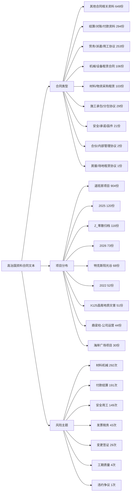

# 高治国资料合同知识框图

```mermaid
flowchart LR
  A[高治国资料合同文本] --> B[合同类型]
  A --> C[项目分布]
  A --> D[风险主题]
  B --> B1[其他合同相关资料 649份]
  B --> B2[结算/对账/付款资料 294份]
  B --> B3[劳务/派遣/用工协议 253份]
  B --> B4[机械/设备租赁合同 106份]
  B --> B5[材料/物资采购租赁 103份]
  B --> B6[施工承包/分包协议 29份]
  B --> B7[安全/承诺/函件 21份]
  B --> B8[合伙/内部管理协议 2份]
  B --> B9[房屋/场地租赁协议 1份]
  C --> C1[道班房项目 904份]
  C --> C2[2025 120份]
  C --> C3[Z_零散归档 116份]
  C --> C4[2026 73份]
  C --> C5[特克斯阳光谷 68份]
  C --> C6[2022 52份]
  C --> C7[X125昌南地质灾害 51份]
  C --> C8[鼎梁柱-公司运营 44份]
  C --> C9[海岸广场项目 30份]
  D --> D1[材料机械 292次]
  D --> D2[付款结算 191次]
  D --> D3[安全用工 149次]
  D --> D4[发票税务 43次]
  D --> D5[变更签证 29次]
  D --> D6[工期质量 4次]
  D --> D7[违约争议 1次]
```
