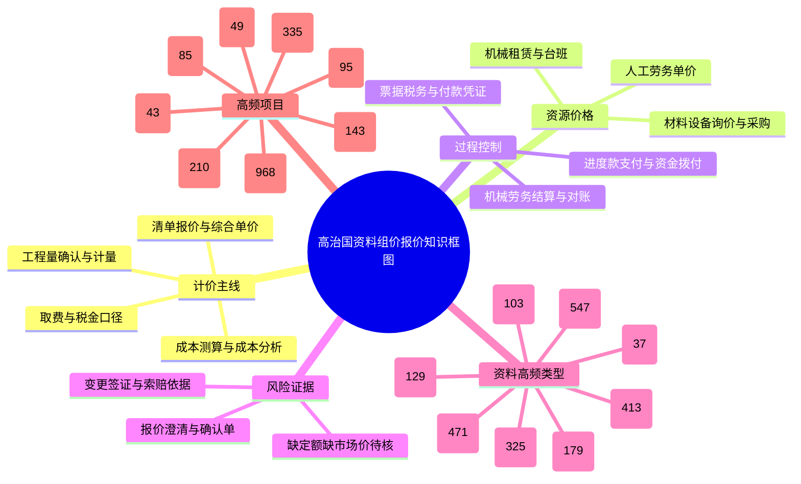

# 高治国资料组价报价知识整理

- 扫描日期: 2026-06-16
- 源目录: `D:\高治国资料`
- 处理原则: 仅只读扫描源文件；未删除、未移动、未改名任何源文件。
- 全量跑过文件数: 12026
- 进入组价报价候选索引: 2209
- 支持内容摘要抽取的候选数: 1352
- 计价口径: 新疆2024版优先；管理费28%、利润18%、规费22%、税9%。本次为资料知识整理，不进行新报价测算。

## 知识框图

## 资料分布
| 分类 | 数量 | 用途 |
|---|---:|---|
| 材料设备询价与采购 | 547 | 材料主材价、采购计划、消耗台账 |
| 清单报价与综合单价 | 471 | 报价形成、投标测算、综合单价复核 |
| 工程量确认与计量 | 413 | 工程量边界、现场确认、计价基础 |
| 进度款支付与资金拨付 | 325 | 支付节点、资金拨付、付款证据 |
| 机械劳务结算与对账 | 179 | 台班租赁、劳务结算、分包对账 |
| 其他组价报价支撑资料 | 129 | 间接支撑报价和成本判断的资料 |
| 成本测算与成本分析 | 103 | 人工/材料/机械/管理利润拆分和盈亏判断 |
| 票据税务与付款凭证 | 37 | 发票、外经证、税务和付款闭环 |
| 变更签证与索赔依据 | 5 | 变更计价、签证证据、澄清记录 |

## 项目/目录分布 TOP20
| 项目/目录 | 文件数 |
|---|---:|
| 道班房项目 | 968 |
| Z_零散归档 | 335 |
| 青河G331项目 | 210 |
| 哈密国源综合服务中心项目 | 143 |
| 特克斯阳光谷 | 95 |
| 海岸广场项目 | 85 |
| G217图木舒克服务区 | 49 |
| X125昌南地质灾害 | 43 |
| 新疆和田项目 | 43 |
| 喀什体育运动学校 | 38 |
| 鼎梁柱-公司运营 | 38 |
| 博乐前进水源护坡 | 30 |
| 米兰道路工程 | 30 |
| 通衢隧道洞口坡面治理 | 29 |
| 鄯善启创科技中建五局 | 23 |
| 天山乡项目 | 15 |
| 阿勒泰机场劳务 | 7 |
| G0711乌尉高速 | 6 |
| 2024杂项资料 | 4 |
| 新疆鼎梁柱中建一局博乐前进水源项目标一经济报价 | 3 |

## 文件类型分布
| 扩展名 | 文件数 |
|---|---:|
| .xlsx | 1404 |
| .pdf | 280 |
| .xls | 218 |
| .docx | 177 |
| .jpg | 31 |
| .md | 16 |
| .csv | 14 |
| .doc | 12 |
| .py | 11 |
| .zip | 10 |
| .dwg | 10 |
| .txt | 6 |
| .json | 6 |
| .png | 5 |
| .PDF | 4 |
| .XLS | 1 |
| .wps | 1 |
| .bat | 1 |
| .rar | 1 |
| .GBQ7 | 1 |

## 风险分级
| 等级 | 含义 | 数量 |
|---|---|---:|
| 🔴 | 出现未支付、争议、欠付、作废等强风险关键词 | 27 |
| 🟡 | 需要确认、澄清、变更、签证、对账等复核资料 | 449 |
| 🔵 | 常规报价/计量/采购支撑资料 | 1733 |

## 可复用知识结构
| 模块 | 应沉淀内容 | 当前资料来源 |
|---|---|---|
| 清单-定额匹配 | 清单项名称、工作内容、计量单位、可参照定额 | 清单报价表、成本分析表、报价澄清函 |
| 四维成本拆解 | 人工、辅材、主材、机械，以及管理费/利润/规费/税 | 成本分析表、材料采购台账、机械租赁对账单 |
| 市场价依据 | 供应商报价、采购记录、发票、项目消耗台账 | 物资采购、发票、询价/采购计划 |
| 工程量证据链 | 图纸量、现场确认量、计量支付量、变更签证量 | 工程量确认单、进度款与支付、变更签证 |
| 分包结算口径 | 劳务单价、机械台班、租赁边界、对账确认 | 劳务单价表、机械结算清单、对账单 |
| 风险控制 | 缺定额、缺市场价、缺图纸信息、付款票据缺口 | 澄清函、确认单、发票、资金拨付资料 |

## 重点样本 TOP50
| 分类 | 风险 | 项目/目录 | 文件名 | 摘要 |
|---|---|---|---|---|
| 成本测算与成本分析 | 🟡 | Z_零散归档 | 五彩湾融创铝制品厂各专业工程量清单报价表（预算价）2026.4.19.xlsx | [汇总表] 造价汇总表（预算价） / / / / / / / / / / / / 项目名称：五彩湾融创铝制品厂 / / / / / / / / / / / / 序号 / 工程内容 / 不含税总价 / 税金 / 含税总价（元） / 建筑面积  |
| 材料设备询价与采购 | 🟡 | 道班房项目 | K248+500、K284+800 道班房2025年12月结算计价与清单工程量对照表2025.12.2.xlsx | [结算对比总表] G331线青河至富蕴至阿勒泰段公路建设项目(EPC模式)(二标段) / / / / / / / / / / / / K248+500、K284+800道班房2025年12月结算工程量及计价对照表 / / / / / / / |
| 材料设备询价与采购 | 🟡 | 道班房项目 | K248+500、K284+800 道班房2025年12月结算计价与清单工程量对照表2025.12.2_1.xlsx | [结算对比总表] G331线青河至富蕴至阿勒泰段公路建设项目(EPC模式)(二标段) / / / / / / / / / / / / K248+500、K284+800道班房2025年12月结算工程量及计价对照表 / / / / / / / |
| 材料设备询价与采购 | 🟡 | 道班房项目 | K248+500、K284+800 道班房2025年12月结算计价与清单工程量对照表2025.12.9日改.xlsx | [结算对比总表] G331线青河至富蕴至阿勒泰段公路建设项目(EPC模式)(二标段) / / / / / / / / / / / / K248+500、K284+800道班房2025年12月结算工程量及计价对照表 / / / / / / / |
| 材料设备询价与采购 | 🟡 | 道班房项目 | K248+500、K284+800 道班房2025年12月结算计价与清单工程量对照表2025.12.9日改_1.xlsx | [结算对比总表] G331线青河至富蕴至阿勒泰段公路建设项目(EPC模式)(二标段) / / / / / / / / / / / / K248+500、K284+800道班房2025年12月结算工程量及计价对照表 / / / / / / / |
| 材料设备询价与采购 | 🟡 | 道班房项目 | K248+500、K284+800 道班房各期计价结算与清单工程量对照表2025.8.5.xlsx | [K248+500、K284.800道班房] G331线青河至富蕴至阿勒泰段公路建设项目(EPC模式)(二标段) / / / / / / / / / / / / K248+500、K284.800道班房工程量清单（截止2025.8.5） / |
| 材料设备询价与采购 | 🟡 | 道班房项目 | K248+500、K284+800 道班房各期计价结算与清单工程量对照表2025.8.5_1.xlsx | [K248+500、K284.800道班房] G331线青河至富蕴至阿勒泰段公路建设项目(EPC模式)(二标段) / / / / / / / / / / / / K248+500、K284.800道班房工程量清单（截止2025.8.5） / |
| 材料设备询价与采购 | 🟡 | 道班房项目 | K248+500、K284+800 道班房第五期后计价结算与清单工程量对照表2025.9.3.xlsx | [K248+500、K284.800道班房] G331线青河至富蕴至阿勒泰段公路建设项目(EPC模式)(二标段) / / / / / / / / / / / / K248+500、K284.800道班房工程量清单（截止2025.9.3） / |
| 材料设备询价与采购 | 🟡 | 道班房项目 | K248+500、K284+800 道班房第五期后计价结算与清单工程量对照表2025.9.3_1.xlsx | [K248+500、K284.800道班房] G331线青河至富蕴至阿勒泰段公路建设项目(EPC模式)(二标段) / / / / / / / / / / / / K248+500、K284.800道班房工程量清单（截止2025.9.3） / |
| 材料设备询价与采购 | 🟡 | 道班房项目 | K248+500、K284+800 道班房第六期后计价结算与清单工程量对照表2025.10.8.xlsx | [K248+500、K284.800道班房] G331线青河至富蕴至阿勒泰段公路建设项目(EPC模式)(二标段) / / / / / / / / / / / / K248+500、K284.800道班房工程量清单（截止2025.9.3） / |
| 材料设备询价与采购 | 🟡 | 道班房项目 | K248+500、K284+800 道班房第六期后计价结算与清单工程量对照表2025.10.8_1.xlsx | [K248+500、K284.800道班房] G331线青河至富蕴至阿勒泰段公路建设项目(EPC模式)(二标段) / / / / / / / / / / / / K248+500、K284.800道班房工程量清单（截止2025.9.3） / |
| 材料设备询价与采购 | 🟡 | 道班房项目 | K248+500、K284+800 道班房2025年12月结算计价与清单工程量对照表2025.12.2.xlsx | [结算对比总表] G331线青河至富蕴至阿勒泰段公路建设项目(EPC模式)(二标段) / / / / / / / / / / / / K248+500、K284+800道班房2025年12月结算工程量及计价对照表 / / / / / / / |
| 材料设备询价与采购 | 🟡 | 道班房项目 | K248+500、K284+800 道班房各期计价结算与清单工程量对照表2025.8.5.xlsx | [K248+500、K284.800道班房] G331线青河至富蕴至阿勒泰段公路建设项目(EPC模式)(二标段) / / / / / / / / / / / / K248+500、K284.800道班房工程量清单（截止2025.8.5） / |
| 材料设备询价与采购 | 🟡 | 道班房项目 | K248+500、K284+800 道班房2025年12月结算计价与清单工程量对照表2025.12.9日改.xlsx | [结算对比总表] G331线青河至富蕴至阿勒泰段公路建设项目(EPC模式)(二标段) / / / / / / / / / / / / K248+500、K284+800道班房2025年12月结算工程量及计价对照表 / / / / / / / |
| 材料设备询价与采购 | 🟡 | 道班房项目 | K248+500、K284+800 道班房第五期后计价结算与清单工程量对照表2025.9.3.xlsx | [K248+500、K284.800道班房] G331线青河至富蕴至阿勒泰段公路建设项目(EPC模式)(二标段) / / / / / / / / / / / / K248+500、K284.800道班房工程量清单（截止2025.9.3） / |
| 材料设备询价与采购 | 🟡 | 道班房项目 | K248+500、K284+800 道班房第六期后计价结算与清单工程量对照表2025.10.8.xlsx | [K248+500、K284.800道班房] G331线青河至富蕴至阿勒泰段公路建设项目(EPC模式)(二标段) / / / / / / / / / / / / K248+500、K284.800道班房工程量清单（截止2025.9.3） / |
| 材料设备询价与采购 | 🟡 | Z_零散归档 | 五彩湾融创铝制品厂各专业工程量清单报价表（成本价）2026.4.19.xlsx | [汇总表] 造价汇总表（成本价） / / / / / / / / / / / / 项目名称：五彩湾融创铝制品厂 / / / / / / / / / / / / 序号 / 工程内容 / 不含税总价 / 税金 / 含税总价（元） / 建筑面积  |
| 清单报价与综合单价 | 🔵 | X125昌南地质灾害 | 昌吉南部山区滑坡地质灾害工程量清单报价单(1).xlsx | [Sheet1] 昌吉市南部山区地质灾害高风险区崩塌、滑坡重点灾害排危除险项目工程量清单报价 / / / / / / / / / / / / 序号 / 分项工程 / 单位 / 工程量 / 劳务单价 / 机械单价 / 劳务费小计 / 机械费小 |
| 清单报价与综合单价 | 🔵 | X125昌南地质灾害 | 昌吉南部山区滑坡地质灾害工程量清单报价单.xlsx | [Sheet1] 昌吉市南部山区地质灾害高风险区崩塌、滑坡重点灾害排危除险项目工程量清单报价 / / / / / / / / / / / / 序号 / 分项工程 / 单位 / 工程量 / 劳务单价 / 机械单价 / 劳务费小计（含3%税金） |
| 清单报价与综合单价 | 🔵 | X125昌南地质灾害 | 昌吉南部山区滑坡地质灾害工程量清单报价单（杨永久）2025.6.3.xlsx | [Sheet1] 昌吉市南部山区地质灾害高风险区崩塌、滑坡重点灾害排危除险项目工程量清单报价 / / / / / / / / / / / / 序号 / 分项工程 / 单位 / 工程量 / 劳务单价 / 机械单价 / 劳务费小计 / 机械费小 |
| 清单报价与综合单价 | 🟡 | 道班房项目 | K248+500、K284+800道班房工程量清单投标报价2400xlsx.xlsx | [K248+500、K284.800道班房] / G331线青河至富蕴至阿勒泰段公路建设项目(EPC模式)(二标段) / / / / / / / / / / / / K248+500、K284.800道班房工程量清单 / / / / / / |
| 清单报价与综合单价 | 🟡 | 道班房项目 | K248+500、K284+800道班房工程量清单投标报价2472xlsx.xlsx | [K248+500、K284.800道班房] / G331线青河至富蕴至阿勒泰段公路建设项目(EPC模式)(二标段) / / / / / / / / / / / / K248+500、K284.800道班房工程量清单 / / / / / / |
| 清单报价与综合单价 | 🟡 | 道班房项目 | 富年K248+500、K284+800道班房工程量清单投标报价2024.8.22.xlsx | [K248+500、K284.800道班房] / G331线青河至富蕴至阿勒泰段公路建设项目(EPC模式)(二标段) / / / / / / / / / / / / K248+500、K284.800道班房工程量清单 / / / / / / |
| 清单报价与综合单价 | 🟡 | 道班房项目 | 富年K248+500、K284+800道班房工程量清单投标报价2024.9.14.xlsx | [K248+500、K284.800道班房] / G331线青河至富蕴至阿勒泰段公路建设项目(EPC模式)(二标段) / / / / / / / / / / / / K248+500、K284.800道班房工程量清单 / / / / / / |
| 清单报价与综合单价 | 🟡 | 道班房项目 | 富年K248+500、K284+800道班房工程量清单投标报价2478.5.xlsx | [K248+500、K284.800道班房] / G331线青河至富蕴至阿勒泰段公路建设项目(EPC模式)(二标段) / / / / / / / / / / / / K248+500、K284.800道班房工程量清单 / / / / / / |
| 清单报价与综合单价 | 🟡 | 道班房项目 | 泓久K248+500、K284+800道班房工程量清单投标报价2024.8.22.xlsx | [K248+500、K284.800道班房] / G331线青河至富蕴至阿勒泰段公路建设项目(EPC模式)(二标段) / / / / / / / / / / / / K248+500、K284.800道班房工程量清单 / / / / / / |
| 清单报价与综合单价 | 🟡 | 道班房项目 | 泓久K248+500、K284+800道班房工程量清单投标报价2024.9.14.xlsx | [K248+500、K284.800道班房] / G331线青河至富蕴至阿勒泰段公路建设项目(EPC模式)(二标段) / / / / / / / / / / / / K248+500、K284.800道班房工程量清单 / / / / / / |
| 清单报价与综合单价 | 🟡 | 道班房项目 | K248+500、K284+800 道班房门窗护栏分项工程量清单报价表2025.6.4.xlsx | [门窗钢护栏工程] G331线青河至富蕴至阿勒泰段公路建设项目(EPC模式)(二标段) / / / / / / / / / / / / K248+500、K284.800道班房门窗、钢护栏工程量清单 / / / / / / / / / /  |
| 清单报价与综合单价 | 🔵 | 鄯善启创科技中建五局 | 吐鲁番鄯善XXX工业厂房_工程量清单与成本报价.xlsx | [工程量清单与成本报价] 吐鲁番鄯善地区 XXX工业厂房 工程量清单与成本报价表 / / / / / / / / / / / / 编制日期：2026年5月29日 建筑面积：1,000.00 m2 结构：门式刚架+砖墙 编制依据：吐鲁 / / |
| 清单报价与综合单价 | 🔵 | Z_零散归档 | K6+760.7中桥工程量清单报价单.xlsx | [表格_20260207] K6+760.7（3×13m）中桥工程量清单报价单 / / / / / / / / / / / / 序号 / 项目名称 / 单位 / 工程量 / 综合单价（元） / 合价（元） / 备注 / / / / / /  |
| 清单报价与综合单价 | 🔵 | Z_零散归档 | 两座小桥工程量清单报价单.xlsx | [表格_20260207 (3)] 两座小桥工程量清单报价单 / / / / / / / / / / / / 序号 / 项目名称 / 单位 / 工程量 / 参考综合单价（元） / 合价（元） / 备注 / / / / / / 一、上部构造  |
| 清单报价与综合单价 | 🔵 | Z_零散归档 | 恰尔巴格乡村组道路提升改造项目 工程量清单核对表及成本分析.xlsx | [表格_20260507 (22)] 莎车县 2026 年恰尔巴格乡村组道路提升改造项目 工程量清单核对表及成本分析 / / / / / / / / / / / / 细目号 / 细目名称 / 细目描述 / 单位 / 工程数量 / 综合单价  |
| 机械劳务结算与对账 | 🔵 | Z_零散归档 | 倾库尔1号大桥工程量清单（劳务清包工）报价表（调整单价和备注说明）2026.4.24.xlsx | [倾库尔1号大桥] 倾库尔1号大桥 (K71+872/ZK71+855) 工程量清单报价表 / / / / / / / / / / / / 序号 / 分项工程 / 项目特征描述 / 单位 / 预算工程量（按实际完成量结算） / 不含税单价（ |
| 材料设备询价与采购 | 🟡 | Z_零散归档 | G219温泉至霍尔果斯公路护坡变更工程固化清单报价单.xlsx | [标段一] 序号 / 子目名称 / 单位 / 工程量 / 单价（元） / 合价（元） / / / 单价包含的内容 / 备注 / / / 1 / 1-φ1.5m圆管涵 / 米 / 197.77 / 1810 / 357963.7 / / /  |
| 材料设备询价与采购 | 🔵 | Z_零散归档 | 倾库尔1号大桥 工程量清单报价表.xlsx | [倾库尔1号大桥] 倾库尔1号大桥 (K71+872/ZK71+855) 工程量清单报价表 / / / / / / / / / / / / 序号 / 分部工程 / 分项工程 / 项目特征描述 / 单位 / 工程量 / 不含税单价（元） /  |
| 材料设备询价与采购 | 🔵 | Z_零散归档 | 守望天山大桥工程量清单报价表.xlsx | [守望天山大桥] 守望天山大桥 (K69+728/ZK69+734) 工程量清单报价表 / / / / / / / / / / / / 序号 / 分部工程 / 分项工程 / 项目特征描述 / 单位 / 工程量 / 不含税单价（元） / 其中 |
| 材料设备询价与采购 | 🔵 | Z_零散归档 | 守望天山大桥工程量清单报价表报价表（工程量修改后）2026.4.24.xlsx | [表格_20260424 (11)] 守望天山大桥 (K69+728/ZK69+734) 工程量清单报价表 / / / / / / / / / / / / 序号 / 分项工程 / 项目特征描述 / 单位 / 修正后工程量 / 不含税单价（元 |
| 材料设备询价与采购 | 🔵 | Z_零散归档 | 守望天山大桥工程量清单报价表报价表（工程量修改后）2026.4.24_1.xlsx | [表格_20260424 (11)] 守望天山大桥 (K69+728/ZK69+734) 工程量清单报价表 / / / / / / / / / / / / 序号 / 分项工程 / 项目特征描述 / 单位 / 修正后工程量 / 不含税单价（元 |
| 材料设备询价与采购 | 🔵 | Z_零散归档 | 守望天山大桥工程量清单报价表（改）.xlsx | [守望天山大桥] 守望天山大桥 (K69+728/ZK69+734) 工程量清单报价表 / / / / / / / / / / / / 序号 / 分部工程 / 分项工程 / 项目特征描述 / 单位 / 工程量 / 不含税单价（元） / 其中 |
| 材料设备询价与采购 | 🔵 | Z_零散归档 | 守望天山大桥工程量清单（劳务清包工）报价表（调整单价和备注说明）2026.4.25.xlsx | [守望天山大桥] 守望天山大桥 (K69+728/ZK69+734) 工程量清单报价表 / / / / / / / / / / / / 序号 / 分项工程 / 项目特征描述 / 单位 / 修正后工程量 / 不含税单价（元） / 其中：人工  |
| 清单报价与综合单价 | 🟡 | 道班房项目 | K248+500、K284+800道班房工程量清单投标报价2400xlsx.xlsx | [K248+500、K284.800道班房] / G331线青河至富蕴至阿勒泰段公路建设项目(EPC模式)(二标段) / / / / / / / / / / / / K248+500、K284.800道班房工程量清单 / / / / / / |
| 清单报价与综合单价 | 🟡 | 道班房项目 | K248+500、K284+800道班房工程量清单投标报价2472xlsx.xlsx | [K248+500、K284.800道班房] / G331线青河至富蕴至阿勒泰段公路建设项目(EPC模式)(二标段) / / / / / / / / / / / / K248+500、K284.800道班房工程量清单 / / / / / / |
| 清单报价与综合单价 | 🟡 | 道班房项目 | 富年K248+500、K284+800道班房工程量清单投标报价2024.8.22.xlsx | [K248+500、K284.800道班房] / G331线青河至富蕴至阿勒泰段公路建设项目(EPC模式)(二标段) / / / / / / / / / / / / K248+500、K284.800道班房工程量清单 / / / / / / |
| 清单报价与综合单价 | 🟡 | 道班房项目 | 富年K248+500、K284+800道班房工程量清单投标报价2024.9.14.xlsx | [K248+500、K284.800道班房] / G331线青河至富蕴至阿勒泰段公路建设项目(EPC模式)(二标段) / / / / / / / / / / / / K248+500、K284.800道班房工程量清单 / / / / / / |
| 清单报价与综合单价 | 🟡 | 道班房项目 | 富年K248+500、K284+800道班房工程量清单投标报价2478.5.xlsx | [K248+500、K284.800道班房] / G331线青河至富蕴至阿勒泰段公路建设项目(EPC模式)(二标段) / / / / / / / / / / / / K248+500、K284.800道班房工程量清单 / / / / / / |
| 清单报价与综合单价 | 🟡 | 道班房项目 | 泓久K248+500、K284+800道班房工程量清单投标报价2024.8.22.xlsx | [K248+500、K284.800道班房] / G331线青河至富蕴至阿勒泰段公路建设项目(EPC模式)(二标段) / / / / / / / / / / / / K248+500、K284.800道班房工程量清单 / / / / / / |
| 清单报价与综合单价 | 🟡 | 道班房项目 | 泓久K248+500、K284+800道班房工程量清单投标报价2024.9.14.xlsx | [K248+500、K284.800道班房] / G331线青河至富蕴至阿勒泰段公路建设项目(EPC模式)(二标段) / / / / / / / / / / / / K248+500、K284.800道班房工程量清单 / / / / / / |
| 清单报价与综合单价 | 🔵 | 新疆鼎梁柱中建一局博乐前进水源项目标一经济报价 | 附件6-标一合同工程量清单报价单.xlsx | 读取失败:BadZipFile |
| 清单报价与综合单价 | 🔵 | 博乐前进水源护坡 | 附件6-标一合同工程量清单报价单.xlsx | [01合同工程量清单 标一] 附件一： / / / / / / / / / / / / 博州博乐市前进水源工程设计采购施工总承包（EPC）项目护坡工程--合同单价表 / / / / / / / / / / / / 工程名称：博州博乐市前进水 |
| 清单报价与综合单价 | 🔵 | Z_零散归档 | 倾库尔1号大桥 工程量清单报价表（改）.xlsx | [倾库尔1号大桥] 倾库尔1号大桥 (K71+872/ZK71+855) 工程量清单报价表 / / / / / / / / / / / / 序号 / 分部工程 / 分项工程 / 项目特征描述 / 单位 / 工程量 / 不含税单价（元） /  |

## 不确定性与后续动作
- ⚠ 缺定额子目: 本次未接入新疆2024定额库逐项匹配，后续应把清单报价表中的清单项导入定价引擎核对定额编号。
- ⚠ 缺市场价: 本次只能识别采购、发票、询价类依据存在性，未联网校验当期新疆市场价；建议补充新疆住建厅造价信息、供应商三方报价、近期发票。
- ⚠ 缺图纸信息: 工程量确认单可作为现场量证据，但涉及尺寸/做法仍需回查图纸或签认单。
- ⚠ 旧项目资料: 2022-2025项目资料可作为本地案例参考，不得直接替代2026当期市场价。

## 输出文件
- `高治国资料组价报价文件索引.xlsx`: 可筛选文件索引。
- `高治国资料组价报价文件索引.csv`: 同步 CSV 版本。
- `高治国资料组价报价知识框图.mmd`: Mermaid 框图源码。
- `高治国资料组价报价扫描明细.json`: 机器可读明细。

## 输出前自检
- 新疆2024版: 已作为整理口径标注；未做定额套价。
- 市场价依据: 已标明需按当期新疆市场补证。
- 费率: 管理28% / 利润18% / 规费22% / 税9% 已锁定为项目口径。
- 四维拆解: 已作为知识结构字段沉淀，具体金额待后续表格逐项计算。
- 风险: 已按 🔴🟡🔵 标注。
