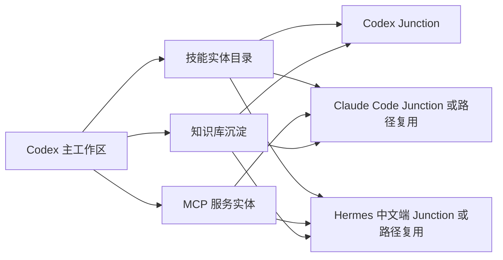

# AI工具与技能知识卡片总集

## 1. 总览结论

本次沉淀对象为 Codex 当前主工作区已经安装并验证的技能、插件、MCP 服务，以及可共享给 Claude Code、Hermes Agent 中文端的复用路径。

| 类别 | 数量 | 主路径 | 当前状态 |
|---|---:|---|---|
| 工作区技能实体 | 66 | `D:\Codex_Workspace\skills_plugins\codex-skills` | 已安装 |
| Codex 技能入口 | 66 | `C:\Users\20752\.codex\skills` | Junction 已建立 |
| Codex 系统内置技能 | 5 | `C:\Users\20752\.codex\skills\.system` | 内置可用 |
| Codex 桌面插件 | 7 | Codex 桌面版内置插件缓存 | 内置可用 |
| Codex MCP 服务 | 9 | `C:\Users\20752\.codex\config.toml` | 已接入 |

## 2. 安装根目录卡片

| 项目 | 路径 | 用途 |
|---|---|---|
| Codex 主工作区 | `D:\Codex_Workspace` | 技能实体、MCP源码、npm全局包、共享方案存放 |
| Codex 技能实体 | `D:\Codex_Workspace\skills_plugins\codex-skills` | 66个可复用技能实体 |
| Codex 技能入口 | `C:\Users\20752\.codex\skills` | Codex 运行时读取入口，使用 Junction 指向实体目录 |
| npm 全局包 | `D:\Codex_Workspace\npm-global` | Node 类 MCP 服务安装位置 |
| npm 缓存 | `D:\Codex_Workspace\npm-cache` | npm 缓存目录 |
| MCP 源码归档 | `D:\Codex_Workspace\mcp-servers` | GitHub MCP 等源码或可执行文件归档 |
| 知识库目标目录 | `D:\知识库\07-AI工具与技能` | 本知识卡片沉淀目录 |

## 3. 技能分层卡片

### 3.1 造价核心与项目成本执行层

| 技能目录 | 核心用途 | 适用场景 |
|---|---|---|
| `ddc-payment-application-processor` | 处理工程付款申请、产值、保留金 | 进度款、付款审核 |
| `ddc-retention-tracker` | 跟踪保留金、释放条件 | 分包结算、回款管理 |
| `ddc-cashflow-forecaster` | 预测项目现金流 | 月度资金计划、资金缺口识别 |
| `ddc-change-order-analysis` | 分析变更类型、费用和工期影响 | 签证变更评估 |
| `ddc-open-construction-estimate` | 使用开放造价数据库进行估算 | 快速估算、基准价对比 |
| `ddc-labor-rate` | 计算人工单价、班组组成、效率因素 | 人工费测算 |
| `ddc-unit-price-database-manager` | 管理综合单价数据库 | 企业价格库维护 |
| `ddc-auto-estimate-generator` | 根据工程量自动生成估算 | BIM/QTO 到估算 |
| `ddc-cost-prediction` | 基于历史数据预测成本 | 项目早期成本预测 |
| `ddc-historical-cost-analyzer` | 历史成本分析和趋势校准 | 指标库、复盘、对标 |
| `ddc-cost-estimation-resource` | 资源法成本估算 | 人材机拆解 |
| `ddc-estimate-builder` | 编制造价估算明细 | 成本测算、投标报价辅助 |
| `ddc-budget-variance-analyzer` | 预算与实际偏差分析 | 成本控制、动态预警 |
| `ddc-bid-analysis-comparator` | 承包商投标对比分析 | 商务标评审 |
| `ddc-payment-application-generator` | 生成 AIA 类付款申请 | 付款申请文档输出 |
| `ddc-xlsx-construction` | 工程 Excel 表格处理 | 清单、台账、估算表 |

### 3.2 进度、现场、索赔与合同辅助层

| 技能目录 | 核心用途 | 适用场景 |
|---|---|---|
| `ddc-critical-path-analyzer` | 关键路径分析 | 工期风险识别 |
| `ddc-schedule-delay-analyzer` | 工期延误原因和影响分析 | 工期索赔、延期评估 |
| `ddc-delay-analysis` | 延误分析、时间影响分析、损失计算 | 争议与索赔材料 |
| `ddc-schedule-cost-link` | 进度与成本挂接 | 资金曲线、挣值管理 |
| `ddc-daily-progress-report` | 自动生成每日进度报告 | 现场日报 |
| `ddc-daily-report-generator` | 从现场数据生成日报 PDF | 项目过程资料 |
| `ddc-change-order-processor` | 变更单流程处理 | 审批、成本、进度影响跟踪 |
| `ddc-change-order-manager` | 变更管理与审计轨迹 | 争议预防、变更闭环 |
| `ddc-claims-documentation` | 索赔证据、损失、通知要求整理 | 工程索赔包 |
| `ddc-contract-clause-analyzer` | 合同条款风险识别 | 合同审查 |
| `ddc-contract-clause-extractor` | 合同关键条款抽取 | 付款、变更、争议、保修条款 |
| `ddc-kpi-dashboard` | 项目 KPI 仪表板 | CPI、SPI、质量、安全跟踪 |
| `ddc-material-delivery-tracker` | 材料到货与库存跟踪 | 供应链、现场物流 |
| `ddc-portfolio-dashboard` | 多项目组合看板 | 公司级项目经营分析 |

### 3.3 文档、数据、可视化与 AI 工作流层

| 技能目录 | 核心用途 | 适用场景 |
|---|---|---|
| `ddc-docx-construction` | 工程 Word 文档生成 | 合同、报告、方案、传送单 |
| `ddc-pptx-construction` | 工程 PPT 生成 | 项目汇报、投标演示 |
| `ddc-pdf-construction` | 工程 PDF 处理 | 合并、提取、表单、包件整理 |
| `ddc-pdf-to-structured` | PDF 转结构化数据 | 规范、BOM、清单、报告抽取 |
| `ddc-email-construction` | 工程邮件生成 | RFI、变更通知、会议通知 |
| `ddc-llm-document-extraction` | LLM 文档结构化抽取 | 合同、规范、RFI、报审资料 |
| `ddc-document-classification-nlp` | 工程文件 NLP 分类 | RFI、报审、合同、规范归档 |
| `ddc-data-visualization` | 工程数据可视化 | 图表、热力图、仪表板 |
| `ddc-drawing-analyzer` | 图纸尺寸、标注、符号提取 | 工程量复核、设计审查 |
| `ddc-prompt-templates` | 工程 AI Prompt 模板 | 标准化提示词库 |
| `ddc-few-shot-examples` | 工程任务 Few-shot 示例 | 分类、抽取、分析稳定性提升 |
| `ddc-verification-loop-construction` | 工程成果验证闭环 | 估算、进度、报告交付前复核 |
| `ddc-continuous-learning-construction` | 从工作会话沉淀模式和经验 | SOP、复盘、持续优化 |

### 3.4 CWICR 资源法数据库方法层

| 技能目录 | 核心用途 | 适用场景 |
|---|---|---|
| `ddc-cwicr-cost-calculator` | CWICR 资源法成本计算 | 人材机透明拆解 |
| `ddc-cwicr-takeoff-helper` | 工程量辅助计算 | 尺寸推量、损耗、关联工作项 |
| `ddc-cwicr-overhead-markup` | 管理费、利润、间接费计算 | 报价策略分析，费率需确认 |
| `ddc-cwicr-escalation` | 价格上涨和指数调整 | 材料、人工价格调整 |
| `ddc-cwicr-value-engineering` | 价值工程替代分析 | 降本方案比选 |
| `ddc-cwicr-historical-cost` | CWICR 历史成本管理 | 项目复盘和指标库 |
| `ddc-cwicr-location-factor` | 区域系数调整 | 地区人工、材料、市场差异 |
| `ddc-cwicr-multilingual` | 多语言 CWICR 数据处理 | 跨语言资料匹配 |
| `ddc-cwicr-rate-updater` | 资源价格更新 | 市场价维护 |
| `ddc-cwicr-waste-calculator` | 材料损耗计算 | 切割损耗、运输损耗、施工损耗 |
| `ddc-cwicr-work-breakdown` | 工作项资源拆解 | 资源清单、成本组成 |
| `ddc-cwicr-quantity-matcher` | BIM 工程量匹配 CWICR 工作项 | BIM-QTO 到成本项 |
| `ddc-semantic-search-cwicr` | CWICR 语义搜索 | 相似工作项和资源查找 |

### 3.5 CAD/BIM 转换层

| 技能目录 | 核心用途 | 适用场景 |
|---|---|---|
| `ddc-dwg-to-excel` | DWG 转 Excel 数据库 | 图层、块、属性、几何数据提取 |
| `ddc-ifc-to-excel` | IFC 转 Excel 数据库 | BIM 属性和构件信息提取 |
| `ddc-ifc-qto-extraction` | IFC/Revit 工程量提取 | 面积、体积、长度、构件数量 |

### 3.6 效率增强与通用能力层

| 技能目录 | 核心用途 | 适用场景 |
|---|---|---|
| `baoyu-diagram` | 生成专业暗色 SVG 图 | 架构图、流程图、关系图 |
| `baoyu-infographic` | 生成高密度信息图 | 方案比选、汇报图解 |
| `baoyu-translate` | 中英翻译与精翻 | 技术文档、合同资料翻译 |
| `baoyu-markdown-to-html` | Markdown 转 HTML | 微信排版、知识库发布 |
| `research-codex-zh` | 初步研究并生成大纲 | 技术选型、资料调研 |
| `research-deep-codex-zh` | 深度研究任务拆解 | 多主题并行研究 |
| `research-report-codex-zh` | 汇总研究报告 | Markdown 研究报告输出 |

### 3.7 Codex 系统内置技能

| 技能名 | 用途 |
|---|---|
| `imagegen` | AI 位图生成和编辑 |
| `openai-docs` | OpenAI / Codex 官方文档查询 |
| `plugin-creator` | 创建 Codex 插件 |
| `skill-creator` | 创建 Codex 技能 |
| `skill-installer` | 安装 Codex 技能 |

## 4. Codex 桌面插件卡片

| 插件 | 技能名 | 共享判断 |
|---|---|---|
| browser | `control-in-app-browser` | Codex 内置，不直接共享；其他 Agent 需装自身浏览器能力 |
| chrome | `control-chrome` | Codex 内置，不直接共享；依赖用户 Chrome 会话 |
| computer-use | `computer-use` | Codex 内置，不直接共享；其他 Agent 需自身桌面控制模块 |
| documents | documents | Codex 内置，不直接共享 |
| pdf | pdf | Codex 内置，不直接共享 |
| presentations | Presentations | Codex 内置，不直接共享 |
| spreadsheets | Spreadsheets | Codex 内置，不直接共享 |

## 5. MCP 服务卡片

| MCP 服务 | 当前入口 | 共享判断 | 注意事项 |
|---|---|---|---|
| `node_repl` | Codex 内置 node_repl.exe | 不建议共享 | Codex 私有运行时 |
| `filesystem` | Node + `@modelcontextprotocol/server-filesystem` | 可共享 | 建议授权 `D:\Codex_Workspace` 与 `D:\知识库` |
| `memory` | Node + `@modelcontextprotocol/server-memory` | 可共享 | 可作为轻量知识图谱运行时 |
| `sequential-thinking` | Node + `@modelcontextprotocol/server-sequential-thinking` | 可共享 | 适合复杂推理链 |
| `github` | `D:\Codex_Workspace\mcp-servers\github-mcp\github-mcp-server.exe stdio` | 可共享 | 使用 `${GITHUB_PERSONAL_ACCESS_TOKEN}` |
| `firecrawl` | Node + `firecrawl-mcp` | 可共享 | 使用 `${FIRECRAWL_API_KEY}`，不要写明文 Key |
| `mcp-cron` | Node + `mcp-cron --transport stdio` | 可共享 | 必须保留 `--transport stdio` |
| `fetch` | Python 3.12 + `-m mcp_server_fetch` | 可共享 | 不使用 uvx；uvx 在本机被安全软件拦截 |
| `context7` | Node + `@upstash/context7-mcp` | 可共享 | 获取最新库文档 |

## 6. 共享架构卡片

共享原则：Codex 作为主安装源，技能实体不重复复制；Claude Code 和 Hermes Agent 优先通过 Junction、配置路径或只读引用复用。MCP 服务优先复用同一套 Node、Python、npm-global、mcp-servers 资产；各 Agent 只维护自己的配置入口和密钥环境变量。

## 7. 环境与风险卡片

| 项目 | 当前结论 |
|---|---|
| Python | 使用 `C:\Users\20752\AppData\Local\Programs\Python\Python312\python.exe` |
| uvx | 本机受 QClaw 拦截，不作为 MCP fetch 启动方式 |
| Git | 需要 `git -c http.sslBackend=openssl`，避免 schannel 被安全软件拦截 |
| Node | 使用 `C:\Program Files\nodejs\node.exe` |
| 明文密钥 | 后续文档只写环境变量名，不再写明文 Key |
| 工程造价费率 | 不固定默认管理费、利润、规费、税率；缺依据标 `⚠费率待确认` |

## 8. 验收记录

| 验收项 | 结果 |
|---|---|
| `D:\Codex_Workspace\skills_plugins\codex-skills` 技能目录数 | 66 |
| `C:\Users\20752\.codex\skills` Junction 技能入口数 | 66 |
| `C:\Users\20752\.codex\skills\.system` 系统技能数 | 5 |
| `C:\Users\20752\.codex\config.toml` MCP 服务数 | 9 |
| 知识库卡片命名 | 中文命名 |

---

🔗 **AI工具总览**：[[07-AI工具与技能/AI工具与技能-总览]]
