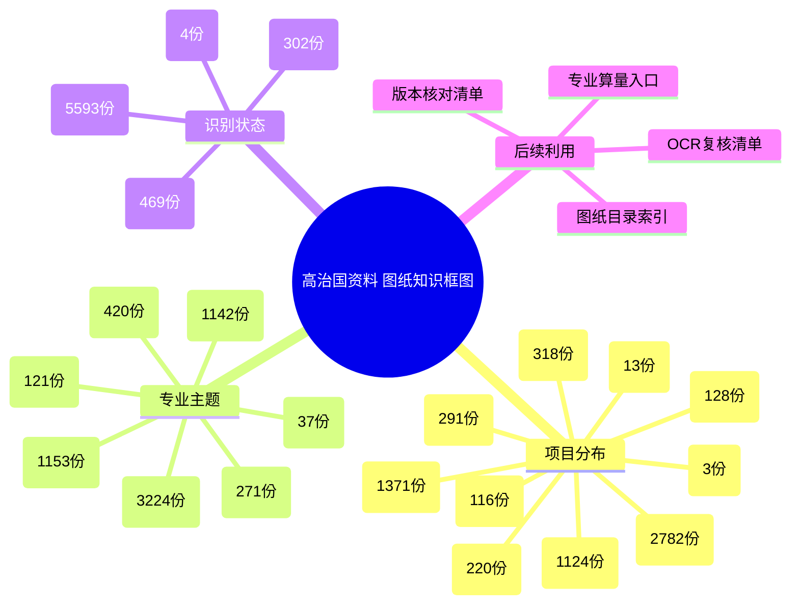

# 高治国资料图纸文档知识整理

- 源目录：`D:\高治国资料`
- 生成时间：2026-06-16 19:43:02
- 处理方式：只读扫描源文件；未删除、未移动、未改名源文件。
- 文件索引：`高治国资料_图纸文件索引.csv`
- 图纸相关文件数：6368

## 知识框图

## 文件类型统计
| 类型 | 数量 |
|---|---:|
| .pdf | 3865 |
| .dwg | 1495 |
| .xlsx | 340 |
| .docx | 133 |
| .xls | 131 |
| .png | 131 |
| .jpg | 108 |
| .doc | 102 |
| .tif | 63 |

## 项目分布
| 项目/一级目录 | 数量 |
|---|---:|
| Z_零散归档 | 2782 |
| 道班房项目 | 1371 |
| 2025 | 1124 |
| 海岸广场项目 | 318 |
| 2022 | 291 |
| 特克斯阳光谷 | 220 |
| 2026 | 128 |
| X125昌南地质灾害 | 116 |
| 2024 | 13 |
| 鼎梁柱-公司运营 | 3 |
| 2023 | 2 |

## 专业主题
| 主题 | 数量 | 适用整理方向 |
|---|---:|---|
| 未判定 | 3224 | 需人工按图名或打开文件补充分组 |
| 房建结构 | 1153 | 道班房/综合楼结构钢筋、门窗做法入口 |
| 路线/总图 | 1142 | 建立坐标、平纵、总体布置索引 |
| 机电/照明 | 420 | 设备、照明、安装工程索引 |
| 桥涵结构 | 271 | 桥涵构造物清单、钢筋与混凝土工程量入口 |
| 地质灾害治理 | 121 | 抗滑桩、锚杆锚索、格构梁、截排水算量入口 |
| 路基防护排水 | 37 | 边沟、护坡、挡墙、排水沟工程量入口 |

## 重点目录
| 目录 | 文件数 |
|---|---:|
| `01_进行中项目\道班房项目\03-图纸资料` | 1234 |
| `Z_零散归档\新疆中科能源项目\03-图纸资料` | 1163 |
| `2025\喀什体育运动学校\03-图纸资料` | 777 |
| `Z_零散归档\新疆华贸百盈\03-图纸资料` | 597 |
| `Z_零散归档\吐哈油田鄯善东风电\03-图纸资料` | 368 |
| `01_进行中项目\海岸广场项目\03-图纸资料` | 316 |
| `2025\G217图木舒克服务区\03-图纸资料` | 253 |
| `01_进行中项目\特克斯阳光谷\03-图纸资料` | 220 |
| `Z_零散归档\和田昆仑文化园一期\03-图纸资料` | 183 |
| `Z_零散归档\五彩湾融创铝制品厂房\03-图纸资料` | 104 |
| `2022\青河G331项目\09-人员与行政` | 98 |
| `2022\青河G331项目\02-工程量与计价` | 90 |
| `01_进行中项目\X125昌南地质灾害\09-人员与行政\施工图片记录` | 77 |
| `01_进行中项目\道班房项目\02-工程量与计价` | 72 |
| `2022\青河G331项目\03-图纸资料` | 68 |
| `Z_零散归档\厂前区装修工程\03-图纸资料` | 42 |
| `Z_零散归档\其他零散文件\03-图纸资料` | 41 |
| `Z_零散归档\库尔勒凌爵室外绿化景观\03-图纸资料` | 41 |
| `01_进行中项目\X125昌南地质灾害\03-图纸资料` | 32 |
| `01_进行中项目\道班房项目\06-物资采购` | 27 |

## 风险与待复核
| 等级 | 类型 | 文件数 | 处理建议 |
|---|---|---:|---|
| 🟡 | missing_text | 4405 | 扫描件/图片化文件，可检索文字不足，后续算量前需 OCR 复核 |
| 🟡 | dwg_only | 1495 | DWG 文件未解析实体，需 CAD 引擎或人工打开核对图层/比例 |

## 样例索引
| 项目 | 专业 | 文件 | 页/表 | 状态 |
|---|---|---|---:|---|
| 2022 | 桥涵结构 | `2022\青河G331项目\01-合同招投标\青河县边境经济合作区基础设施建设项目一期第一合同段--两阶段施工图设计(1)(1).xlsx` | 2 | text-extracted |
| 2022 | 桥涵结构 | `2022\青河G331项目\01-合同招投标\青河县边境经济合作区基础设施建设项目一期第一合同段--两阶段施工图设计(1)(2).xlsx` | 1 | text-extracted |
| 2022 | 未判定 | `2022\青河G331项目\01-合同招投标\青河县边境经济合作区基础设施建设项目一期第一合同段--两阶段施工图设计(1).pdf` |  | metadata-only: PyMuPDF unavailable |
| 2022 | 路基防护排水 | `2022\青河G331项目\01-合同招投标\青河县边境经济合作区基础设施建设项目一期第一合同段--两阶段施工图设计(1).xlsx` | 1 | text-extracted |
| 2022 | 未判定 | `2022\青河G331项目\02-工程量与计价\(其中箍筋）钢筋级别直径汇总表2024-09-09-09-11-59.xls` |  | metadata-only |
| 2022 | 未判定 | `2022\青河G331项目\02-工程量与计价\(汇总表）钢筋级别直径汇总表2024-09-09-10-58-28.xls` |  | metadata-only |
| 2022 | 房建结构 | `2022\青河G331项目\02-工程量与计价\1#综合楼12#钢筋下料表.xls` |  | metadata-only |
| 2022 | 房建结构 | `2022\青河G331项目\02-工程量与计价\1#综合楼14#钢筋下料表.xls` |  | metadata-only |
| 2022 | 房建结构 | `2022\青河G331项目\02-工程量与计价\1#综合楼16#钢筋下料汇总表.xls` |  | metadata-only |
| 2022 | 房建结构 | `2022\青河G331项目\02-工程量与计价\1#综合楼一层框梁钢筋下料表.xls` |  | metadata-only |
| 2022 | 房建结构 | `2022\青河G331项目\02-工程量与计价\1#综合楼二层屋面天沟板钢筋下料表.xls` |  | metadata-only |
| 2022 | 房建结构 | `2022\青河G331项目\02-工程量与计价\1#综合楼二层屋面框梁钢筋下料表.xls` |  | metadata-only |
| 2022 | 房建结构 | `2022\青河G331项目\02-工程量与计价\1#综合楼二层框柱、三层框柱钢筋下料表.xls` |  | metadata-only |
| 2022 | 房建结构 | `2022\青河G331项目\02-工程量与计价\1#综合楼屋面老虎窗钢筋下料表.xls` |  | metadata-only |
| 2022 | 房建结构 | `2022\青河G331项目\02-工程量与计价\1#综合楼挑高层天沟板钢筋下料表.xls` |  | metadata-only |
| 2022 | 房建结构 | `2022\青河G331项目\02-工程量与计价\1#综合楼挑高层天沟钢筋下料表.xls` |  | metadata-only |
| 2022 | 房建结构 | `2022\青河G331项目\02-工程量与计价\1#综合楼挑高层屋面框梁钢筋下料表.xls` |  | metadata-only |
| 2022 | 房建结构 | `2022\青河G331项目\02-工程量与计价\1#综合楼楼梯钢筋下料表.xlsx` | 1 | text-extracted |
| 2022 | 房建结构 | `2022\青河G331项目\02-工程量与计价\1#综合楼钢筋明细下料表2024.9.9.pdf` |  | metadata-only: PyMuPDF unavailable |
| 2022 | 房建结构 | `2022\青河G331项目\02-工程量与计价\1#综合楼钢筋明细下料表2024.9.9.xls` |  | metadata-only |
| 2022 | 房建结构 | `2022\青河G331项目\02-工程量与计价\1#综合楼钢筋统计汇总表2024-09-09.xls` |  | metadata-only |
| 2022 | 房建结构 | `2022\青河G331项目\02-工程量与计价\1#综合楼首层框柱钢筋下料表.xls` |  | metadata-only |
| 2022 | 房建结构 | `2022\青河G331项目\02-工程量与计价\2#机械库14#钢筋下料明细表.xls` |  | metadata-only |
| 2022 | 房建结构 | `2022\青河G331项目\02-工程量与计价\2#机械库18#钢筋下料明细表.xls` |  | metadata-only |
| 2022 | 房建结构 | `2022\青河G331项目\02-工程量与计价\2#机械库钢筋下料明细表2024-09-09.pdf` |  | metadata-only: PyMuPDF unavailable |
| 2022 | 房建结构 | `2022\青河G331项目\02-工程量与计价\2#机械库钢筋下料明细表2024-09-09.xls` |  | metadata-only |
| 2022 | 未判定 | `2022\青河G331项目\02-工程量与计价\2#机械库钢筋统计汇总表2024-09-09.xls` |  | metadata-only |
| 2022 | 桥涵结构 | `2022\青河G331项目\02-工程量与计价\2022年未完成结构物剩余量表2023.3.21.xlsx` | 1 | text-extracted |
| 2022 | 房建结构 | `2022\青河G331项目\02-工程量与计价\3#设备用房14#钢筋下料明细表.xls` |  | metadata-only |
| 2022 | 房建结构 | `2022\青河G331项目\02-工程量与计价\3#设备用房16#钢筋下料明细表.xls` |  | metadata-only |
| 2022 | 房建结构 | `2022\青河G331项目\02-工程量与计价\3#设备用房18#钢筋下料明细表.xls` |  | metadata-only |
| 2022 | 房建结构 | `2022\青河G331项目\02-工程量与计价\3#设备用房楼梯钢筋下料表.xlsx` | 1 | text-extracted |
| 2022 | 房建结构 | `2022\青河G331项目\02-工程量与计价\3#设备用房钢筋下料明细表2024-09-09.pdf` |  | metadata-only: PyMuPDF unavailable |
| 2022 | 房建结构 | `2022\青河G331项目\02-工程量与计价\3#设备用房钢筋下料明细表2024-09-09.xls` |  | metadata-only |
| 2022 | 机电/照明 | `2022\青河G331项目\02-工程量与计价\3#设备用房钢筋统计汇总表2024-09-09.xls` |  | metadata-only |
| 2022 | 房建结构 | `2022\青河G331项目\02-工程量与计价\6#圆盘北屯下料单K248+500道班2#机械库钢筋下料明细表2024-09-10.xls` |  | metadata-only |
| 2022 | 房建结构 | `2022\青河G331项目\02-工程量与计价\6#圆盘北屯下料单K284+800道班2#机械库钢筋下料明细表2024-09-10.xls` |  | metadata-only |
| 2022 | 房建结构 | `2022\青河G331项目\02-工程量与计价\6#盘圆北屯下料单K248+500道班房3#设备用房钢筋下料明细表2024-09-10.xls` |  | metadata-only |
| 2022 | 房建结构 | `2022\青河G331项目\02-工程量与计价\6#盘圆北屯下料单K284+800道班房3#设备用房钢筋下料明细表2024-09-10.xls` |  | metadata-only |
| 2022 | 路线/总图 | `2022\青河G331项目\02-工程量与计价\81-84管涵坐标表.xlsx` | 1 | text-extracted |
| 2022 | 路基防护排水 | `2022\青河G331项目\02-工程量与计价\82-84排水沟.xlsx` | 3 | text-extracted |
| 2022 | 路线/总图 | `2022\青河G331项目\02-工程量与计价\G331k68-84管涵坐标表.xlsx` | 6 | text-extracted |
| 2022 | 桥涵结构 | `2022\青河G331项目\02-工程量与计价\G331一标四工区桥涵队计价结算统计表2022.10.15.xlsx` | 1 | text-extracted |
| 2022 | 桥涵结构 | `2022\青河G331项目\02-工程量与计价\G331一标四工区桥涵队高治国管涵砂浆钢丝网施作计量统计表2024.10.3.xlsx` | 1 | text-extracted |
| 2022 | 桥涵结构 | `2022\青河G331项目\02-工程量与计价\G331一标四工区桥涵队高治国管涵砂浆钢丝网施作计量统计表2024.7.16.xlsx` | 1 | text-extracted |
| 2022 | 桥涵结构 | `2022\青河G331项目\02-工程量与计价\G331一标涵洞等结构物统计表.xlsx` | 5 | text-extracted |
| 2022 | 桥涵结构 | `2022\青河G331项目\02-工程量与计价\G331线青富阿公路四工区桥涵队入库台账.xlsx` | 8 | text-extracted |
| 2022 | 桥涵结构 | `2022\青河G331项目\02-工程量与计价\G331线青富阿公路四工区桥涵队汽油台账.xlsx` | 1 | text-extracted |
| 2022 | 桥涵结构 | `2022\青河G331项目\02-工程量与计价\G680青河段三座通道桥工程量及设计图2023.3.14.pdf` |  | metadata-only: PyMuPDF unavailable |
| 2022 | 桥涵结构 | `2022\青河G331项目\02-工程量与计价\G680青河段二座通道涵工程量及设计图2023.3.14.pdf` |  | metadata-only: PyMuPDF unavailable |
| 2022 | 桥涵结构 | `2022\青河G331项目\02-工程量与计价\G680青河段平交道口K0+017道箱涵工程量及设计图2023.3.14.pdf` |  | metadata-only: PyMuPDF unavailable |
| 2022 | 桥涵结构 | `2022\青河G331项目\02-工程量与计价\G680青河段平交道口K0+158道箱涵工程量及设计图2023.3.14.pdf` |  | metadata-only: PyMuPDF unavailable |
| 2022 | 桥涵结构 | `2022\青河G331项目\02-工程量与计价\G680青河段平交道口K0+285道箱涵工程量及设计图2023.3.14.pdf` |  | metadata-only: PyMuPDF unavailable |
| 2022 | 路基防护排水 | `2022\青河G331项目\02-工程量与计价\G680青河段平交道口护坡和挡墙工程量及设计图2023.3.14.pdf` |  | metadata-only: PyMuPDF unavailable |
| 2022 | 路基防护排水 | `2022\青河G331项目\02-工程量与计价\G680青河段结构物附属工程量清单统计表2023.3.14.xlsx` | 1 | text-extracted |
| 2022 | 路基防护排水 | `2022\青河G331项目\02-工程量与计价\G680青河段（改渠）工程量及设计图2023.3.14.pdf` |  | metadata-only: PyMuPDF unavailable |
| 2022 | 路基防护排水 | `2022\青河G331项目\02-工程量与计价\G680青河段（改渠）工程量及设计图2023.xlsx` | 1 | text-extracted |
| 2022 | 房建结构 | `2022\青河G331项目\02-工程量与计价\K248+5001#综合楼基底层框柱钢筋下料表.xls` |  | metadata-only |
| 2022 | 房建结构 | `2022\青河G331项目\02-工程量与计价\K248+5001#综合楼基础梁钢筋下料表.xls` |  | metadata-only |
| 2022 | 房建结构 | `2022\青河G331项目\02-工程量与计价\K248+500道班房1#综合楼一层框梁钢筋下料表.xls` |  | metadata-only |

## 后续使用建议
1. 先按本索引确认最终版图纸，再进入算量或审图，避免多版文件混用。
2. DWG、图片化 PDF、扫描图片需二次 OCR/CAD 解析；本次仅建立只读索引和知识框图。
3. 与造价联动时，建议从地质灾害治理、桥涵结构、路基防护排水三类优先建立工程量拆解表。

## 不确定性
- ⚠ 缺 OCR 引擎时，图片、扫描件只形成元数据索引，不能替代人工识图。
- ⚠ DWG 未解析图元，比例、图层、块参照需后续用 CAD 解析工具复核。
- ⚠ 文件名含工程量/设计图的表格已纳入索引，但具体工程量数值需打开原表逐项核对。

---

🔗 **工程图纸总览**：[[13-工程图纸/工程图纸-总览]]
