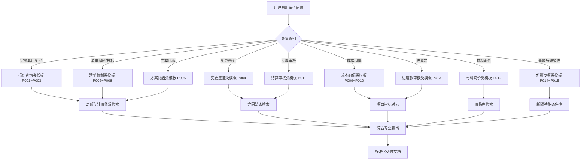

# 新疆造价知识库 · 工作说明书（Instructions）

---

## 一、知识库整体运作逻辑

### 1.1 核心理念

```
用户需求 → 场景匹配 → 模板调用 → 知识检索 → 专业输出
    ↓          ↓          ↓          ↓          ↓
造价问题 → 9大场景 → 20个Prompt → 8大模块知识 → 标准化答案
```

### 1.2 工作流程总览



---

## 二、各模块工作原理

### 模块1：00-首页工作台

#### 工作流程
```
用户打开知识库
    ↓
首页工作台展示
    ├─ 快速导航区 → 一键进入8大模块
    ├─ 常用工具区 → 费率速查、公式速查、单位换算
    ├─ 今日待办区 → 任务提醒、进度跟踪
    └─ 知识更新区 → 最新价格、新规定、新模板
```

#### 使用场景
- 快速查找费率：直接查看费率速查表
- 快速进入某模块：点击导航区对应入口
- 查看最新动态：了解价格波动、政策更新

---

### 模块2：01-定额与计价体系

#### 工作原理
```
输入：定额相关问题
    ↓
检索：核心子目索引（Top 200）
    ↓
匹配：按编号/名称/特征匹配对应定额
    ↓
输出：
    ├─ 定额编号、子目名称、单位
    ├─ 人材机构成、基价
    ├─ 适用范围说明
    ├─ 换算规则
    └─ 新疆特殊调整
```

#### 关键检索逻辑
- **按编号检索**：直接定位具体子目
- **按名称检索**：关键词模糊匹配
- **按特征检索**：根据项目特征智能推荐
- **相似度计算**：推荐最接近的3~5个定额子目供选择

#### 新疆特殊规则库
- 冬季施工增加费计算规则
- 高原地区降效系数
- 风沙地区防护费用
- 抗震构造措施费用

---

### 模块3：02-信息价与市场价

#### 工作原理
```
输入：材料名称 + 地区 + 时间
    ↓
价格库检索
    ├─ 材料库（Top 100）→ 匹配材料
    ├─ 地区库 → 匹配地区价格
    └─ 时间维度 → 价格走势分析
    ↓
输出：
    ├─ 信息价（官方发布）
    ├─ 市场价（市场调研）
    ├─ 价格走势（近3个月）
    ├─ 运杂费计算
    └─ 风险提示
```

#### 价格预警机制
```
价格波动阈值：
    ├─ 钢材：±5%
    ├─ 混凝土：±3%
    ├─ 水泥：±3%
    └─ 其他材料：±8%

超过阈值自动触发：
    ├─ 价格预警标签
    ├─ 调差建议
    └─ 风险提示
```

---

### 模块4：03-合同与法条

#### 工作原理
```
输入：合同条款/法律问题
    ↓
法条库检索
    ├─ 民法典合同编
    ├─ 建设工程司法解释
    ├─ 新疆地方规定
    └─ 风险条款库
    ↓
输出：
    ├─ 相关法条原文
    ├─ 法条解读
    ├─ 风险评级（🔴/🟡/🔵）
    ├─ 应对建议
    └─ 类似案例参考
```

#### 风险评级标准
```
🔴 高风险：
    - 可能造成造价偏差>10%
    - 可能导致工期延误>30天
    - 可能引发法律诉讼

🟡 中风险：
    - 可能造成造价偏差3%~10%
    - 可能导致工期延误7~30天
    - 合同条款有歧义

🔵 低风险：
    - 造价偏差<3%
    - 对工期影响不大
    - 条款基本公平
```

---

### 模块5：04-项目资料

#### 工作原理
```
输入：新项目参数（类型、地区、规模）
    ↓
项目库对标检索
    ├─ 按工程类型匹配
    ├─ 按地区匹配
    └─ 按规模匹配
    ↓
输出：
    ├─ 3~5个类似项目
    ├─ 单方造价对比
    ├─ 人材机构成对比
    ├─ 指标偏差分析
    └─ 报价建议区间
```

#### 对标匹配算法
```
匹配权重：
    ├─ 工程类型：40%
    ├─ 所在地区：30%
    ├─ 项目规模：20%
    └─ 建设时间：10%

输出相似度最高的3~5个项目，
按相似度降序排列
```

---

### 模块6：05-管理模板与工具

#### 工作原理
```
输入：文档类型需求
    ↓
模板库匹配
    ├─ Excel模板（计算类）
    └─ Word模板（报告类）
    ↓
输出：
    ├─ 模板文件下载链接
    ├─ 填写说明
    ├─ 示例数据
    └─ 注意事项
```

#### 模板分类
```
Excel模板（8个）：
    ├─ 工程量计算表
    ├─ 综合单价分析表
    ├─ 造价汇总表
    ├─ 变更签证费用计算表
    ├─ 成本分析表
    ├─ 进度款审核表
    ├─ 材料询价对比表
    └─ 挣值分析表

Word模板（6个）：
    ├─ 招标控制价编制说明
    ├─ 投标报价说明
    ├─ 变更估价申请
    ├─ 索赔报告
    ├─ 结算审核报告
    └─ 造价咨询报告
```

---

### 模块7：06-基础知识库

#### 工作原理
```
输入：学习需求/基础概念问题
    ↓
知识库检索
    ├─ 知识卡片检索（快速答案）
    ├─ 推荐书目（深入学习）
    └─ 学习路线图（系统学习）
    ↓
输出：
    ├─ 基础概念解释
    ├─ 相关知识卡片
    ├─ 推荐学习资源
    └─ 进阶学习路径
```

#### 知识分级体系
```
入门级（了解）：
    ├─ 造价基本概念
    ├─ 定额体系认知
    └─ 清单计价基础

进阶级（掌握）：
    ├─ 定额换算
    ├─ 工程量计算
    ├─ 综合单价分析
    └─ 变更签证处理

专家级（精通）：
    ├─ 投标报价策略
    ├─ 成本管控
    ├─ 索赔处理
    └─ 纠纷解决
```

---

### 模块8：07-Prompt模板库（核心引擎）

#### 8.1 报价咨询类（P001~P003）

**P001 定额套用咨询模板**
```
输入：项目名称 + 特征描述 + 工程量 + 地区
输出：推荐定额 + 套用依据 + 换算说明 + 新疆特殊调整
使用场景：遇到不明确的定额子目、需要判断适用范围、需要进行定额换算
```

**P002 工程量计算模板**
```
输入：构件类型 + 尺寸参数 + 计算规则
输出：计算过程 + 结果 + 规则依据 + 注意事项
使用场景：复杂构件工程量计算、需要展示计算过程、审核工程量
```

**P003 综合单价分析模板**
```
输入：项目编码 + 名称 + 特征 + 定额套用方案
输出：人工费 + 材料费 + 机械费 + 管理费 + 利润 + 规费 + 税金 + 综合单价
使用场景：组价分析、单价对比、不平衡报价策划
```

#### 8.2 清单编制类（P006~P008）

**P006 招标清单编制模板**
```
输入：工程范围 + 专业 + 图纸信息
输出：清单结构 + 项目编码建议 + 特征描述要点 + 注意事项
使用场景：编制招标工程量清单、清单质量检查
```

**P007 招标控制价编制模板**
```
输入：清单 + 定额方案 + 价格信息
输出：控制价汇总 + 各专业造价 + 单方指标 + 编制说明
使用场景：编制招标控制价、控制价审核
```

**P008 投标报价策略模板**
```
输入：项目信息 + 最高限价 + 竞争对手分析 + 成本底线
输出：报价区间建议 + 不平衡报价策略 + 风险点提示 + 报价说明
使用场景：投标报价决策、报价策略制定
```

#### 8.3 变更签证类（P004）

**P004 变更估价模板**
```
输入：变更内容 + 合同约定 + 原单价 + 工程量变化
输出：变更估价原则 + 新单价计算 + 费用变化 + 签证要点
使用场景：处理设计变更、现场签证、费用索赔
```

#### 8.4 方案比选类（P005）

**P005 技术方案经济比选模板**
```
输入：方案A/B描述 + 工程量 + 工期 + 质量要求
输出：各方案造价 + 工期对比 + 风险对比 + 综合评分 + 推荐意见
使用场景：施工方案比选、材料选型、工艺选择
```

#### 8.5 成本纠偏类（P009~P010）

**P009 成本偏差分析模板**
```
输入：目标成本 + 实际成本 + 偏差明细
输出：偏差率计算 + 原因分析 + 纠偏措施 + 预计最终成本
使用场景：月度成本分析、成本超支处理、成本管控
```

**P010 挣值分析(EVM)模板**
```
输入：PV + EV + AC + BAC
输出：CV + SV + CPI + SPI + EAC + 完工预测 + 预警建议
使用场景：项目整体绩效监控、预测完工成本
```

#### 8.6 结算审核类（P011）

**P011 结算审核模板**
```
输入：送审结算 + 合同 + 变更签证 + 隐蔽资料
输出：审减额明细 + 审核依据 + 争议问题 + 审核结论
使用场景：工程结算审核、造价纠纷处理
```

#### 8.7 材料询价类（P012）

**P012 材料询价分析模板**
```
输入：材料名称 + 规格 + 数量 + 地区
输出：多家报价对比 + 价格分析 + 推荐供应商 + 风险提示
使用场景：材料采购询价、价格确认、成本控制
```

#### 8.8 进度款审核类（P013）

**P013 进度款审核模板**
```
输入：已完工程量 + 合同单价 + 累计付款 + 应扣款
输出：本期应付金额计算 + 付款比例核对 + 扣款明细 + 审核意见
使用场景：月度进度款审核、工程款支付控制
```

#### 8.9 新疆专项类（P014~P015）

**P014 新疆冬季施工费用测算模板**
```
输入：冬季施工时间段 + 工程量 + 地区
输出：冬施增加费计算 + 措施项目费用 + 人工降效 + 材料损耗
使用场景：冬施费用测算、冬施方案经济性比选
```

**P015 新疆高原风沙地区施工降效测算模板**
```
输入：海拔高度 + 风沙等级 + 工程类型 + 工期
输出：人工降效系数 + 机械降效系数 + 降效费用计算 + 防护措施费用
使用场景：高原/风沙地区项目报价、成本测算
```

---

## 三、知识检索机制

### 3.1 检索优先级
```
1. 新疆地方规定 > 全国通用规定
2. 合同约定 > 定额规定 > 行业惯例
3. 官方信息价 > 历史成交价 > 市场询价
4. 近期数据 > 远期数据
5. 同地区数据 > 其他地区数据
```

### 3.2 多维度检索
```
按场景检索：9大专业场景
按模板检索：20个Prompt模板
按模块检索：8大知识模块
按关键词检索：全文检索
```

---

## 四、输出规范

### 4.1 标准输出结构
```
## 结论先行（一句话给出核心答案）

## 详细分析（分点阐述）
1. 要点1
2. 要点2
3. 要点3

## 数据支撑（表格/计算过程）
| 项 | 值 | 说明 |
|---|---|---|
|  |  |  |

## 风险提示
⚠ 风险点1
⚠ 风险点2

## 参考依据
- 依据1（新疆2024定额第X章第Y条）
- 依据2（合同第Z条）
```

### 4.2 质量检查清单
- [ ] 结论先行，一句话给出核心答案
- [ ] 数据准确，来源可追溯
- [ ] 包含新疆本地化特殊考虑
- [ ] 风险标注清晰
- [ ] 参考依据明确
- [ ] 格式规范，表格清晰

---

## 五、使用示例

### 示例1：定额套用
```
用户：C30混凝土矩形柱，柱高5m，乌鲁木齐
系统：自动调用P001模板 → 检索定额库 → 输出推荐定额+换算+新疆特殊调整
耗时：约10秒
```

### 示例2：冬季施工测算
```
用户：阿勒泰地区12月~2月施工，求冬施费用
系统：自动调用P014模板 → 检索新疆冬施规定 → 输出冬施增加费计算
耗时：约15秒
```

### 示例3：成本偏差分析
```
用户：目标成本1000万，实际1080万，分析偏差
系统：自动调用P009模板 → 计算偏差率 → 分析原因 → 给出纠偏措施
耗时：约20秒
```

---

## 六、维护更新机制

### 6.1 定期更新
```
定额库：新疆发布新定额后1个月内更新
价格库：每月更新一次信息价
法规库：新法规发布后1周内更新
模板库：每季度补充新模板
```

### 6.2 知识迭代
```
用户反馈 → 问题分析 → 知识补充/修正 → 版本更新
      ↓
每次更新记录变更日志，保持可追溯
```

---

**生成日期**：2026年6月19日
**版本**：v1.0
**适用范围**：新疆造价知识库全体用户
